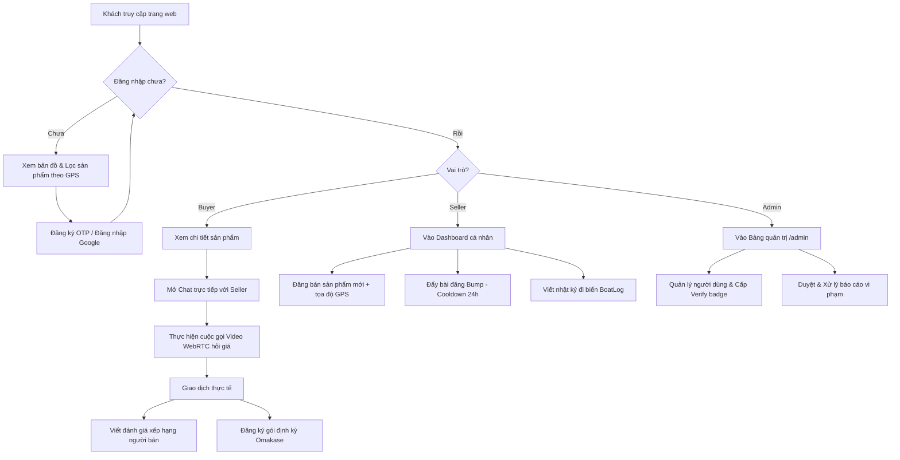
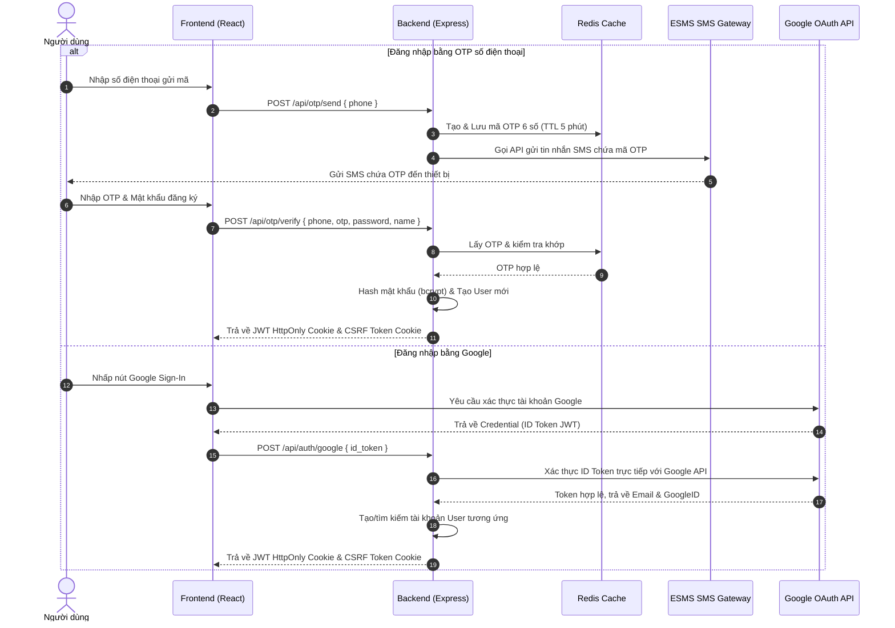
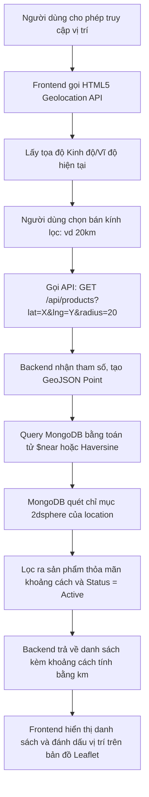
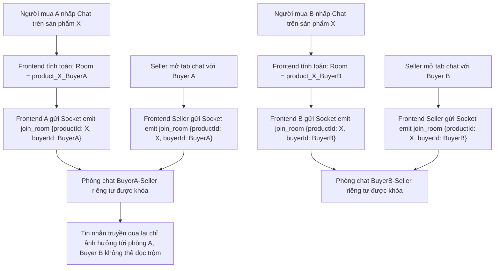
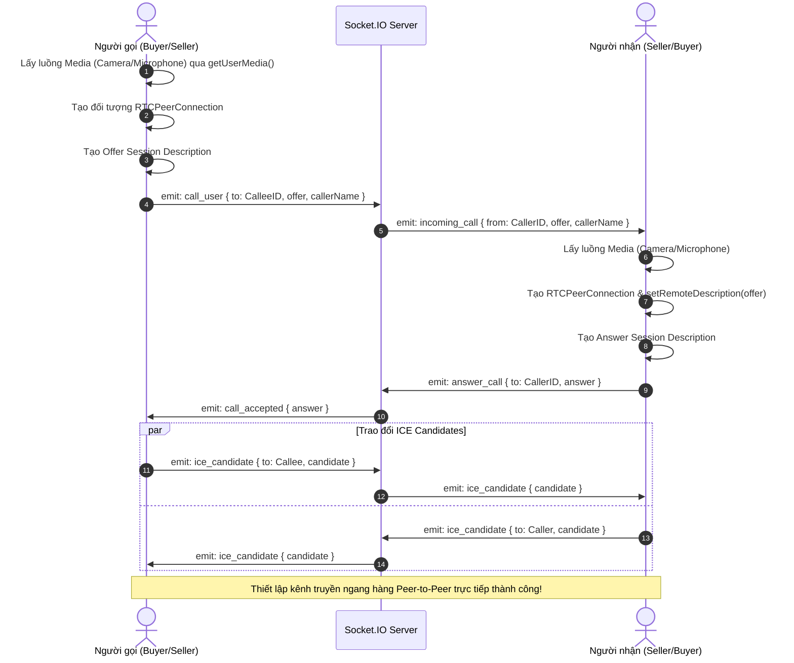
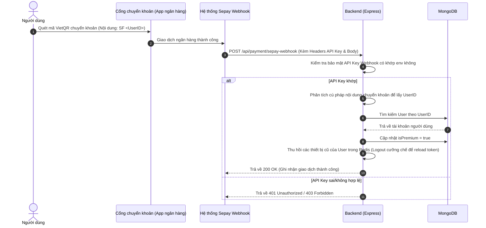
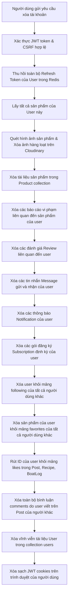
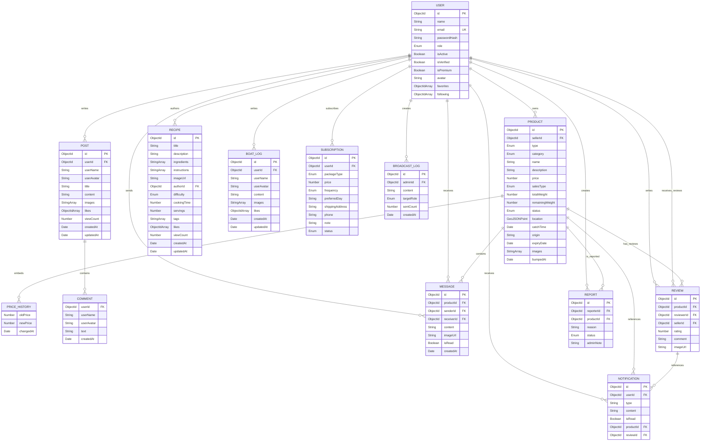

# 🐟 HảiSản.vn — Hệ Thống Chợ Hải Sản Bản Địa Kết Nối Thời Gian Thực Theo Vị Trí (GPS)

> **Dự án thuộc Phase 3: Nền tảng thương mại điện tử kết nối trực tiếp ngư dân (Seller) và người mua (Buyer) tối ưu hóa theo định vị bản đồ và cuộc gọi video thời gian thực.**

---

## 📋 Mục Lục
1. [Giới thiệu & Tổng Quan Dự Án](#1-giới-thiệu--tổng-quan-dự-án)
2. [Các Vai Trò Trong Hệ Thống (Actor Roles)](#2-các-vai-trò-trong-hệ-thống-actor-roles)
3. [Kiến Trúc Hệ Thống & Tech Stack](#3-kiến-trúc-hệ-thống--tech-stack)
4. [Sơ Đồ Luồng Hệ Thống & Use Case (Mermaid Diagrams)](#4-sơ-đồ-luồng-hệ-thống--use-case-mermaid-diagrams)
5. [Đặc Tả Chi Tiết 10 Use Case Hệ Thống (Use Case Specifications)](#5-đặc-tả-chi-tiết-10-use-case-hệ-thống-use-case-specifications)
6. [Thiết Kế Cơ Sở Dữ Liệu & Chỉ Mục (ERD & Mongoose Spec)](#6-thiết-kế-cơ-sở-dữ-liệu--chỉ-mục-erd--mongoose-spec)
7. [Cơ Chế Bảo Mật Toàn Diện (Security Implementations)](#7-cơ-chế-bảo-mật-toàn-diện-security-implementations)
8. [Cấu Trúc Thư Mục Dự Án](#8-cấu-trúc-thư-mục-dự-án)
9. [Hướng Dẫn Cài Đặt & Chạy Local](#9-hướng-dẫn-cài-đặt--chạy-local)
10. [Triển Khai Bằng Docker Compose](#10-triển-khai-bằng-docker-compose)
11. [Danh Sách Các Biến Môi Trường (.env)](#11-danh-sách-các-biến-môi-trường-env)

---

## 1. Giới thiệu & Tổng Quan Dự Án

**HảiSản.vn** giải quyết bài toán cốt lõi của chuỗi cung ứng thủy hải sản truyền thống: **loại bỏ các khâu trung gian thương lái** vốn làm giảm lợi nhuận của ngư dân và tăng giá thành của người mua. Bằng cách ứng dụng công nghệ định vị địa lý (GPS) và truyền dẫn thời gian thực, nền tảng cho phép người tiêu dùng mua được hải sản tươi sống trực tiếp từ các tàu thuyền ngay khi vừa cập bến.

### Các Giá Trị Cốt Lõi:
- **Tươi sống (Freshness)**: Cho phép xem tọa độ đánh bắt thực tế, thời điểm cập bến và hình ảnh sản phẩm thực để chứng thực độ tươi.
- **Tiện lợi (Location-based Discovery)**: Tự động tính toán khoảng cách của người bán tới vị trí hiện tại của người mua theo bán kính tùy chọn (vd: 5km, 10km, 20km).
- **Trực tiếp & Minh bạch (Direct & Transparent)**: Trò chuyện và đàm thoại video WebRTC trực tiếp từ tin nhắn gắn kèm sản phẩm, hệ thống đánh giá xếp hạng và huy hiệu xác minh chống gian lận.

---

## 2. Các Vai Trò Trong Hệ Thống (Actor Roles)

Hệ thống phân quyền chi tiết cho 5 nhóm tác nhân chính:

1. **Khách vãng lai (Guest)**: 
   - Duyệt và tìm kiếm sản phẩm trên bản đồ.
   - Đọc các công thức chế biến hải sản (`Recipe`) và bài viết cộng đồng (`Post`).
   - Đăng ký tài khoản mới bằng số điện thoại (xác minh OTP) hoặc đăng nhập bằng tài khoản Google.
2. **Người mua (Buyer)**: 
   - Quản lý hồ sơ cá nhân, danh sách sản phẩm yêu thích (`Favorites`) và những ngư dân đang theo dõi (`Following`).
   - Trò chuyện trực tuyến (Chat real-time) hoặc thực hiện cuộc gọi video WebRTC với người bán.
   - Viết đánh giá (`Review`) kèm hình ảnh cho sản phẩm đã giao dịch.
   - Báo cáo vi phạm (`Report`) đối với bài đăng không chính xác.
   - Đăng ký gói giao hải sản Omakase định kỳ (`Subscription`).
3. **Ngư dân / Người bán thường (Seller - Fisherman)**: 
   - Có đầy đủ các quyền của Buyer.
   - Đăng tin bán hải sản (Tươi sống: có catchTime & location; Khô: có origin & expiryDate).
   - Cập nhật thông tin/hình ảnh và khối lượng sản phẩm còn lại.
   - Đẩy bài đăng lên đầu trang chủ (`Bump`) - giới hạn cooldown 24 giờ/lần.
   - Viết nhật ký cabin buồng lái (`BoatLog`) để cập nhật hoạt động đi biển hàng ngày.
4. **Ngư dân Premium (Premium Seller)**:
   - Có tất cả quyền của Seller thường.
   - Bài đăng của Premium Seller được thuật toán hiển thị ưu tiên hàng đầu trên bảng tin và bản đồ.
   - Không bị giới hạn nâng cao khi đẩy bài (nếu được cấu hình đặc quyền).
5. **Quản trị viên (Admin)**: 
   - Truy cập trang quản trị tập trung (`/admin`).
   - Xem dashboard thống kê tổng số lượng người dùng, doanh thu, bài đăng và báo cáo.
   - Phê duyệt/từ chối hoặc xử lý các báo cáo vi phạm (`Report`), xóa bài đăng vi phạm.
   - Khóa/mở khóa tài khoản người dùng (`isActive`).
   - Cấp huy hiệu xác minh uy tín (`isVerified`) cho các ngư dân có đầy đủ giấy phép đi biển.

---

## 3. Kiến Trúc Hệ Thống & Tech Stack

Hệ thống được thiết kế theo kiến trúc 3 lớp (3-Tier Architecture) hướng sự kiện (Event-Driven) để đáp ứng thời gian thực:

```
┌────────────────────────────────────────────────────────────────────────┐
│                              CLIENT TIER                               │
│  React 19 · Vite · Leaflet (Bản đồ) · WebRTC (Peer Connection)         │
│  Bootstrap 5 · Socket.IO Client · HTML5 Geolocation API                │
└───────────────────┬─────────────────────────────────┬──────────────────┘
                    │                                 │
                    │ HTTP Requests (REST JSON)       │ WebSocket Events (Signaling)
                    │ (JWT Cookie + CSRF Header)      │ (Bi-directional)
                    ▼                                 ▼
┌────────────────────────────────────────────────────────────────────────┐
│                              SERVER TIER                               │
│  Node.js (v20) · Express (REST API) · Socket.IO Server (Signaling)    │
│  TypeScript · Winston Logger · express-rate-limit · Node-cron (Jobs)   │
└───────────────────┬─────────────────────────────────┬──────────────────┘
                    │                                 │
                    │ ODM (Mongoose)                  │ Pub/Sub & Sessions
                    ▼                                 ▼
┌────────────────────────────────────────┐ ┌─────────────────────────────┐
│             DATABASE TIER              │ │         CACHE & CDN         │
│  MongoDB 7.0 (GeoJSON & Text Index)   │ │  Redis 7.0 (OTP & Cache)    │
│                                        │ │  Cloudinary (Media Delivery)│
└────────────────────────────────────────┘ └─────────────────────────────┘
```

### Tại sao lựa chọn Stack này?
- **TypeScript & Node.js**: TypeScript mang lại sự an toàn về kiểu dữ liệu (Type-safety), giảm thiểu tối đa các lỗi runtime trên cả 2 tầng của server và REST client. Node.js non-blocking I/O xử lý hàng ngàn kết nối WebSocket Socket.IO đồng thời cực kỳ mượt mà.
- **React 19 & Vite**: Vite tối ưu hóa tốc độ đóng gói build production và Hot Module Replacement (HMR) cực nhanh. React 19 cung cấp khả năng tối ưu render tốt và tích hợp lazy-loading chia tách code-splitting thông minh.
- **MongoDB**: Hỗ trợ chỉ mục địa lý gốc `2dsphere` giúp tính toán vị trí theo tọa độ kinh/vĩ độ dạng GeoJSON trực tiếp trong câu lệnh query, mang lại tốc độ truy vấn khoảng cách vượt trội so với SQL truyền thống. Chỉ mục `$text` tối ưu hóa tìm kiếm sản phẩm dạng B-Tree.
- **Redis**: Lưu trữ OTP xác minh với cơ chế tự hủy (TTL) cực nhanh và làm tầng trung gian điều phối (Pub/Sub adapter) cho Socket.IO để hỗ trợ scale-out server sau này.
- **WebRTC**: Cho phép truyền dữ liệu âm thanh/hình ảnh trực tiếp peer-to-peer giữa các trình duyệt mà không cần tốn băng thông trung chuyển qua server, giúp giảm tải tối đa chi phí hạ tầng.

---

## 4. Sơ Đồ Luồng Hệ Thống & Use Case (Mermaid Diagrams)

### 4.1 Sơ đồ luồng tổng thể hệ thống (Global System Flowchart)
Sơ đồ dưới đây biểu diễn hành trình của một người dùng từ khi vào ứng dụng, tìm kiếm sản phẩm và thực hiện giao dịch:



### 4.2 Luồng Xác thực OTP & Google OAuth (Auth Sequence)


### 4.3 Luồng Tìm kiếm & Lọc định vị địa lý GPS (GPS Discovery Flow)


### 4.4 Luồng Phân luồng phòng Chat Socket.IO (Socket Chat Room Isolation)
Để đảm bảo an toàn, bảo mật và không bị rò rỉ tin nhắn chéo giữa các người mua khác nhau đối với cùng một sản phẩm:



### 4.5 Luồng Đàm thoại WebRTC Video Call (WebRTC Signaling Flow)


### 4.6 Luồng Nâng cấp Premium qua Sepay Webhook (Webhook Flow)


### 4.7 Luồng Xóa tài khoản vĩnh viễn tuân thủ GDPR (GDPR Cascade Deletion)


---

## 5. Đặc Tả Chi Tiết 10 Use Case Hệ Thống (Use Case Specifications)

### Use Case 1: Đăng ký & Đăng nhập truyền thống (OTP SMS)
- **Tác nhân (Actor)**: Khách vãng lai (Guest)
- **Tiền điều kiện (Preconditions)**: Khách chưa đăng nhập, thiết bị kết nối mạng, số điện thoại hợp lệ và chưa vượt hạn mức gửi OTP.
- **Luồng sự kiện chính (Main Flow)**:
  1. Khách nhập số điện thoại gửi mã OTP.
  2. Hệ thống tạo mã OTP ngẫu nhiên, lưu vào Redis kèm TTL 5 phút, gọi SMS Gateway gửi OTP.
  3. Khách nhận OTP, nhập mã cùng họ tên và mật khẩu đăng ký.
  4. Hệ thống kiểm tra OTP trong Redis. Nếu khớp, hash mật khẩu bằng Bcrypt và lưu User vào MongoDB.
  5. Cấp Access/Refresh tokens dạng HttpOnly Cookie và sinh CSRF token để chuyển sang trạng thái đăng nhập.
- **Luồng thay thế (Alternative Flows)**: 
  - Mã OTP nhập sai hoặc đã quá hạn 5 phút: Hệ thống trả lỗi `400 Bad Request` yêu cầu gửi lại mã.
  - Số điện thoại đã tồn tại: Chuyển hướng người dùng qua luồng Đăng nhập hoặc khôi phục mật khẩu.
- **Hậu điều kiện (Postconditions)**: Tài khoản mới được tạo, session đăng nhập được thiết lập an toàn trên client.

### Use Case 2: Đăng nhập nhanh qua Google OAuth 2.0
- **Tác nhân (Actor)**: Khách vãng lai (Guest)
- **Tiền điều kiện (Preconditions)**: Thiết bị hỗ trợ Google API, người dùng có tài khoản Google hợp lệ.
- **Luồng sự kiện chính (Main Flow)**:
  1. Người dùng chọn nút Google Sign-In.
  2. Trình duyệt nhận JWT ID Token từ Google Identity Services.
  3. Frontend gửi token lên backend xác thực.
  4. Backend gọi API xác thực Google để lấy email, họ tên và GoogleID của người dùng.
  5. Tạo tài khoản tự động (nếu lần đầu truy cập) hoặc lấy tài khoản cũ.
  6. Thiết lập cookie JWT và trả về thông tin đăng nhập thành công.
- **Hậu điều kiện (Postconditions)**: Người dùng đăng nhập thành công vào hệ thống thông qua tài khoản Google.

### Use Case 3: Đăng bán sản phẩm kèm định vị địa lý (GPS)
- **Tác nhân (Actor)**: Người bán / Ngư dân (Seller)
- **Tiền điều kiện (Preconditions)**: Đã đăng nhập, trình duyệt đã bật định vị (với hải sản tươi).
- **Luồng sự kiện chính (Main Flow)**:
  1. Người bán điền tên sản phẩm, giá, loại (Tươi/Khô), khối lượng, thời gian đánh bắt.
  2. Chọn tải lên tối đa 5 hình ảnh sản phẩm.
  3. Backend nhận ảnh qua Multer, truyền thẳng (stream) dạng buffers lên Cloudinary, lưu các URL ảnh nhận được.
  4. Tự động lưu tọa độ GPS của sản phẩm dạng GeoJSON Point `{ type: "Point", coordinates: [lng, lat] }`.
  5. Lưu thông tin vào MongoDB và trả về mã thành công.
- **Luồng thay thế (Alternative Flows)**: 
  - Trình duyệt từ chối GPS hoặc định giá không hợp lệ: Không thể chọn sản phẩm loại "Tươi" (chỉ được đăng loại "Khô" không bắt buộc tọa độ), hoặc hệ thống báo lỗi validation.
- **Hậu điều kiện (Postconditions)**: Bài đăng sản phẩm ở trạng thái `Active`, xuất hiện trên bản đồ tìm kiếm.

### Use Case 4: Tìm kiếm hải sản quanh vị trí hiện tại (GPS Discovery)
- **Tác nhân (Actor)**: Người mua (Buyer), Khách (Guest)
- **Tiền điều kiện (Preconditions)**: Bật định vị GPS trên trình duyệt của thiết bị.
- **Luồng sự kiện chính (Main Flow)**:
  1. Người dùng vào bản đồ, nhập bán kính lọc (ví dụ: 10km) hoặc từ khóa tìm kiếm.
  2. Hệ thống gọi API gửi tọa độ `[lng, lat]` hiện tại của người dùng lên server.
  3. Backend sử dụng truy vấn địa lý của MongoDB `$near` hoặc công thức toán học Haversine để lọc các sản phẩm có khoảng cách nhỏ hơn bán kính chỉ định.
  4. Trả về danh sách đã phân trang, sắp xếp theo độ ưu tiên: Premium và bài mới đẩy (`bumpedAt`).
- **Hậu điều kiện (Postconditions)**: Danh sách sản phẩm hiển thị trực quan dưới dạng các pin đánh dấu trên bản đồ Leaflet để người dùng tiện theo dõi.

### Use Case 5: Trò chuyện trực tuyến (Real-time Chat) cô lập theo sản phẩm
- **Tác nhân (Actor)**: Người mua (Buyer) và Người bán (Seller)
- **Tiền điều kiện (Preconditions)**: Cả hai đều đã đăng nhập, kết nối WebSocket Socket.IO đang mở.
- **Luồng sự kiện chính (Main Flow)**:
  1. Người mua nhấn chọn "Nhắn tin" trên trang chi tiết sản phẩm.
  2. Hệ thống tự động tạo mã phòng chat định danh riêng biệt: `product_${productId}_${buyerId}`.
  3. Cả Buyer và Seller cùng gia nhập phòng chat này.
  4. Khi một bên gửi tin nhắn, tin nhắn được lưu vào MongoDB (collection `messages`) và phát ngay lập tức tới thành viên còn lại trong phòng chat.
- **Hậu điều kiện (Postconditions)**: Tin nhắn được truyền tải ngay lập tức, đảm bảo tính cô lập, bảo mật và không bị rò rỉ thông tin sang các người mua khác.

### Use Case 6: Cuộc gọi video 1:1 xác thực sản phẩm (Video Call WebRTC)
- **Tác nhân (Actor)**: Người mua và Người bán
- **Tiền điều kiện (Preconditions)**: Đang ở trong cuộc trò chuyện chat trực tiếp, thiết bị có camera/micro và đang chạy trên HTTPS hoặc localhost.
- **Luồng sự kiện chính (Main Flow)**:
  1. Người gọi nhấn biểu tượng Máy quay phim trong khung chat.
  2. Frontend yêu cầu quyền camera/micro, tạo kết nối WebRTC Peer Connection và tạo Offer.
  3. Gửi sự kiện `call_user` thông qua Socket.IO làm Signaling Server.
  4. Người nhận chấp nhận cuộc gọi, tạo Answer và gửi ngược lại.
  5. Hai bên tự động trao đổi ICE candidates và thiết lập luồng video P2P trực tiếp mà không cần đi qua băng thông server.
- **Hậu điều kiện (Postconditions)**: Cuộc gọi video trực tuyến được thiết lập thành công trên giao diện overlay nổi của web.

### Use Case 7: Đăng ký Omakase Hải sản định kỳ (Subscription)
- **Tác nhân (Actor)**: Người mua (Buyer)
- **Tiền điều kiện (Preconditions)**: Đã đăng nhập tài khoản.
- **Luồng sự kiện chính (Main Flow)**:
  1. Người mua vào trang Đăng ký gói định kỳ, chọn kích cỡ gói (Small/Medium/Large) và tần suất (Weekly/BiWeekly/Monthly).
  2. Nhập địa chỉ nhận hàng, số điện thoại liên lạc và ghi chú giao hàng.
  3. Dữ liệu được xác thực nghiêm ngặt qua Zod validation schema (số điện thoại chuẩn Việt Nam, địa chỉ không trống).
  4. Lưu thông tin đăng ký vào MongoDB với trạng thái `Pending` chờ thanh toán.
- **Hậu điều kiện (Postconditions)**: Bản ghi đăng ký được khởi tạo thành công, chờ kích hoạt giao dịch.

### Use Case 8: Thanh toán nâng cấp Premium tự động qua Sepay Webhook
- **Tác nhân (Actor)**: Người dùng (User), Hệ thống Sepay Webhook
- **Tiền điều kiện (Preconditions)**: Người dùng quét mã VietQR chuyển khoản chính xác nội dung hiển thị trên trang.
- **Luồng sự kiện chính (Main Flow)**:
  1. Người dùng thực hiện chuyển khoản thành công qua ngân hàng.
  2. Hệ thống Sepay gọi API Webhook gửi thông tin giao dịch đến server.
  3. Backend xác thực API Key bí mật trong Headers, trích xuất UserID từ nội dung giao dịch.
  4. Cập nhật trường `isPremium = true` cho tài khoản người dùng trong MongoDB.
  5. Cưỡng chế thu hồi toàn bộ Refresh Token của User trong Redis để bắt đầu session Premium mới.
- **Hậu điều kiện (Postconditions)**: Tài khoản được nâng cấp Premium tự động, bài đăng của người dùng được đẩy lên đầu các trang tìm kiếm.

### Use Case 9: Đẩy bài đăng lên đầu danh sách (Product Bumping)
- **Tác nhân (Actor)**: Người bán (Seller)
- **Tiền điều kiện (Preconditions)**: Đã đăng nhập, là chủ sở hữu hợp pháp của sản phẩm đang hoạt động (`Active`).
- **Luồng sự kiện chính (Main Flow)**:
  1. Người bán nhấp vào nút "Đẩy bài" trên sản phẩm của mình.
  2. Server kiểm tra thời điểm đẩy bài trước đó (`bumpedAt`).
  3. Nếu khoảng cách giữa thời điểm hiện tại và `bumpedAt` lớn hơn hoặc bằng 24 giờ, tiến hành cập nhật `bumpedAt = NOW()` và làm mới cache của Redis.
  4. Trả về thông tin đẩy bài thành công.
- **Luồng thay thế (Alternative Flows)**:
  - Thời gian cooldown chưa đủ 24 giờ: Server từ chối và trả về lỗi `400 Bad Request` kèm theo thời gian đếm ngược còn lại.
- **Hậu điều kiện (Postconditions)**: Sản phẩm được sắp xếp lên đầu feed danh sách sản phẩm trang chủ.

### Use Case 10: Xóa tài khoản vĩnh viễn tuân thủ bảo mật GDPR
- **Tác nhân (Actor)**: Người dùng (User)
- **Tiền điều kiện (Preconditions)**: Đăng nhập tài khoản, xác thực JWT và CSRF hợp lệ.
- **Luồng sự kiện chính (Main Flow)**:
  1. Người dùng chọn "Xóa tài khoản vĩnh viễn" trong trang cấu hình cá nhân.
  2. Hệ thống thực hiện thu hồi toàn bộ Refresh Token trong Redis.
  3. Xóa toàn bộ ảnh sản phẩm của người dùng trên Cloudinary.
  4. Thực hiện xóa cascade toàn bộ bài đăng, công thức, nhật ký buồng lái, đánh giá và thông báo thuộc sở hữu của người dùng.
  5. Xóa bỏ ID người dùng khỏi danh sách theo dõi (`following`) và mảng `likes` của các bài đăng khác.
  6. Xóa các bình luận do người dùng viết trên các bài đăng khác.
  7. Xóa vĩnh viễn bản ghi User trong MongoDB, xóa sạch Cookie trình duyệt.
- **Hậu điều kiện (Postconditions)**: Toàn bộ dữ liệu định danh cá nhân của người dùng bị xóa sạch hoàn toàn khỏi hệ thống một cách an toàn.

---

## 6. Thiết Kế Cơ Sở Dữ Liệu & Chỉ Mục (ERD & Mongoose Spec)

### 6.1 Sơ đồ quan hệ thực thể (Database ERD - Entity Relationship Diagram)



---

### 6.2 Đặc tả chi tiết cấu trúc các Collection (Schema Specifications)

#### 1. USER (`users` collection)
| Thuộc tính | Kiểu dữ liệu | Ràng buộc | Mô tả |
|---|---|---|---|
| `_id` | ObjectId | PK, auto | Định danh duy nhất của người dùng |
| `name` | String | Required | Tên hiển thị của người dùng |
| `email` | String | Required, UK, lowercase | Email đăng nhập, lưu dưới dạng chữ thường để kiểm tra trùng |
| `password` | String | Required | Mật khẩu tài khoản (đã hash bằng Bcrypt) |
| `role` | String | Enum, default: `"User"` | Quyền hạn: `"User"` hoặc `"Admin"` |
| `isActive` | Boolean | Default: `true` | Trạng thái tài khoản (nếu false tài khoản sẽ bị khóa) |
| `isVerified` | Boolean | Default: `false` | Đánh dấu ngư dân đã được Admin phê duyệt uy tín |
| `isPremium` | Boolean | Default: `false` | Đánh dấu người dùng đăng ký Premium |
| `avatar` | String | Nullable | URL hình đại diện được upload trên Cloudinary |
| `favorites` | Array[ObjectId] | FK → Product | Danh sách các sản phẩm mà người dùng đã bấm thích/yêu thích |
| `following` | Array[ObjectId] | FK → User | Danh sách các ngư dân mà người dùng này theo dõi |

#### 2. PRODUCT (`products` collection)
| Thuộc tính | Kiểu dữ liệu | Ràng buộc | Mô tả |
|---|---|---|---|
| `_id` | ObjectId | PK, auto | Định danh duy nhất sản phẩm |
| `sellerId` | ObjectId | Required, FK → User | ID của ngư dân/người đăng bán sản phẩm |
| `type` | String | Enum | Loại hải sản: `"Fresh"` (Tươi) hoặc `"Dried"` (Khô) |
| `category` | String | Enum | Phân loại: `"Fish"`, `"Shrimp"`, `"Crab"`, `"Shellfish"`, `"Squid"`, `"Others"` |
| `name` | String | Required, trim | Tên sản phẩm hiển thị |
| `description` | String | Required | Mô tả chi tiết sản phẩm |
| `price` | Number | Required, min: 0 | Đơn giá bán (VND / kg) |
| `salesType` | String | Enum | Hình thức: `"Retail"` (Bán lẻ) hoặc `"Wholesale"` (Bán buôn) |
| `totalWeight` | Number | Required, min: 0.1 | Tổng khối lượng đăng bán ban đầu (kg) |
| `remainingWeight` | Number | Required, min: 0 | Khối lượng thực tế còn lại (kg) |
| `status` | String | Enum, default: `"Active"` | Trạng thái: `"Active"`, `"SoldOut"`, hoặc `"Expired"` |
| `location` | Object (GeoJSON) | Nullable | Tọa độ GPS `{ type: "Point", coordinates: [lng, lat] }` |
| `catchTime` | Date | Nullable | Thời điểm đánh bắt (chỉ yêu cầu đối với `"Fresh"`) |
| `origin` | String | Nullable | Xuất xứ địa lý (chỉ dùng cho `"Dried"`) |
| `expiryDate` | Date | Nullable | Hạn sử dụng (chỉ dùng cho `"Dried"`) |
| `images` | Array[String] | Required | Danh sách URL ảnh sản phẩm (tối đa 5 hình ảnh) |
| `priceHistory` | Array[Object] | Embedded | Lịch sử thay đổi giá gồm: `oldPrice`, `newPrice`, `changedAt` |
| `bumpedAt` | Date | Default: `Date.now` | Thời điểm đẩy bài đăng lên đầu bảng tin gần nhất |

#### 3. POST (`posts` collection)
| Thuộc tính | Kiểu dữ liệu | Ràng buộc | Mô tả |
|---|---|---|---|
| `_id` | ObjectId | PK, auto | Định danh duy nhất của bài viết |
| `userId` | ObjectId | Required, FK → User | Tác giả viết bài viết cộng đồng |
| `userName` | String | Required | Tên tác giả (Denormalized để hiển thị nhanh) |
| `userAvatar` | String | Nullable | Ảnh đại diện tác giả (Denormalized) |
| `title` | String | Required, trim | Tiêu đề bài viết |
| `content` | String | Required | Nội dung chi tiết bài viết |
| `images` | Array[String] | Default: `[]` | Ảnh đính kèm bài viết |
| `likes` | Array[ObjectId] | FK → User | Danh sách người dùng đã thích bài viết |
| `comments` | Array[Object] | Embedded | Bình luận nhúng gồm: `userId` (FK → User), `userName`, `userAvatar`, `text`, `createdAt` |
| `tags` | Array[String] | Default: `[]` | Các thẻ hashtag nội dung |
| `viewCount` | Number | Default: 0 | Lượt xem bài viết |

#### 4. RECIPE (`recipes` collection)
| Thuộc tính | Kiểu dữ liệu | Ràng buộc | Mô tả |
|---|---|---|---|
| `_id` | ObjectId | PK, auto | Định danh công thức |
| `title` | String | Required, trim | Tên món ăn / công thức |
| `description` | String | Required | Mô tả sơ lược |
| `ingredients` | Array[String] | Default: `[]` | Danh sách các nguyên liệu cần chuẩn bị |
| `instructions` | Array[String] | Default: `[]` | Các bước thực hiện chi tiết |
| `imageUrl` | String | Nullable | Ảnh thành phẩm món ăn |
| `authorId` | ObjectId | Required, FK → User | Người đăng tải công thức nấu ăn |
| `difficulty` | String | Enum, default: `"Medium"` | Độ khó chế biến: `"Easy"`, `"Medium"`, hoặc `"Hard"` |
| `cookingTime` | Number | Default: 30 | Thời gian thực hiện (phút) |
| `servings` | Number | Default: 2 | Khẩu phần ăn cho bao nhiêu người |
| `tags` | Array[String] | Default: `[]` | Thẻ phân loại nguyên liệu (cá, mực, tôm...) |
| `likes` | Array[ObjectId] | FK → User | Danh sách người dùng thích công thức nấu ăn này |
| `viewCount` | Number | Default: 0 | Số lượt xem công thức |

#### 5. BOAT_LOG (`boatlogs` collection)
| Thuộc tính | Kiểu dữ liệu | Ràng buộc | Mô tả |
|---|---|---|---|
| `_id` | ObjectId | PK, auto | Định danh nhật ký cabin |
| `userId` | ObjectId | Required, FK → User | Ngư dân thực hiện ghi nhật ký hành trình |
| `userName` | String | Required | Tên tác giả ghi nhật ký (Denormalized) |
| `userAvatar` | String | Nullable | Ảnh đại diện ngư dân (Denormalized) |
| `content` | String | Required | Ghi chép nhật ký đi biển hàng ngày |
| `images` | Array[String] | Default: `[]` | Hình ảnh đánh bắt thực tế ngoài khơi |
| `likes` | Array[ObjectId] | FK → User | Số lượt yêu thích từ người theo dõi |

#### 6. MESSAGE (`messages` collection)
| Thuộc tính | Kiểu dữ liệu | Ràng buộc | Mô tả |
|---|---|---|---|
| `_id` | ObjectId | PK, auto | Định danh tin nhắn |
| `productId` | ObjectId | Required, FK → Product | ID sản phẩm liên quan đến cuộc hội thoại trò chuyện |
| `senderId` | ObjectId | Required, FK → User | ID người gửi tin nhắn |
| `receiverId` | ObjectId | Required, FK → User | ID người nhận tin nhắn |
| `content` | String | Required (nếu không ảnh) | Nội dung văn bản của tin nhắn |
| `imageUrl` | String | Required (nếu không chữ)| URL ảnh hải sản chụp gửi đính kèm |
| `isRead` | Boolean | Default: `false` | Trạng thái tin nhắn đã được đọc hay chưa |

#### 7. REVIEW (`reviews` collection)
| Thuộc tính | Kiểu dữ liệu | Ràng buộc | Mô tả |
|---|---|---|---|
| `_id` | ObjectId | PK, auto | Định danh review |
| `productId` | ObjectId | Required, FK → Product | Sản phẩm được đánh giá |
| `reviewerId` | ObjectId | Required, FK → User | ID người viết đánh giá (Buyer) |
| `sellerId` | ObjectId | Required, FK → User | ID ngư dân nhận đánh giá (Denormalized để truy vấn xếp hạng nhanh) |
| `rating` | Number | Required, 1 - 5 | Điểm xếp hạng từ 1 đến 5 sao |
| `comment` | String | Nullable | Nhận xét chi tiết của người mua |
| `imageUrl` | String | Nullable | Ảnh chụp thực tế của sản phẩm nhận được |

#### 8. REPORT (`reports` collection)
| Thuộc tính | Kiểu dữ liệu | Ràng buộc | Mô tả |
|---|---|---|---|
| `_id` | ObjectId | PK, auto | Định danh báo cáo |
| `reporterId` | ObjectId | Required, FK → User | Người gửi báo cáo vi phạm |
| `productId` | ObjectId | Required, FK → Product | Sản phẩm bị báo cáo vi phạm |
| `reason` | String | Required | Lý do báo cáo vi phạm |
| `status` | String | Enum, default: `"Pending"` | Trạng thái: `"Pending"`, `"Resolved"`, hoặc `"Dismissed"` |
| `adminNote` | String | Nullable | Ghi chú phản hồi của Admin sau khi xem xét báo cáo |

#### 9. NOTIFICATION (`notifications` collection)
| Thuộc tính | Kiểu dữ liệu | Ràng buộc | Mô tả |
|---|---|---|---|
| `_id` | ObjectId | PK, auto | Định danh thông báo |
| `userId` | ObjectId | Required, FK → User | Người nhận thông báo |
| `type` | String | Required | Loại: `"new_message"`, `"new_review"`, `"system"` |
| `content` | String | Required | Nội dung thông báo hiển thị |
| `isRead` | Boolean | Default: `false` | Trạng thái thông báo đã được đọc hay chưa |
| `productId` | ObjectId | Optional, FK → Product | Liên kết sản phẩm liên quan (nếu có) |
| `reviewId` | ObjectId | Optional, FK → Review | Liên kết đánh giá liên quan (nếu có) |

#### 10. SUBSCRIPTION (`subscriptions` collection)
| Thuộc tính | Kiểu dữ liệu | Ràng buộc | Mô tả |
|---|---|---|---|
| `_id` | ObjectId | PK, auto | Định danh gói đăng ký định kỳ |
| `userId` | ObjectId | Required, FK → User | Người đăng ký mua gói hải sản định kỳ Omakase |
| `packageType` | String | Enum | Gói hải sản: `"Small"`, `"Medium"`, hoặc `"Large"` |
| `price` | Number | Required | Đơn giá thanh toán chu kỳ của gói |
| `frequency` | String | Enum | Tần suất giao: `"Weekly"`, `"BiWeekly"`, hoặc `"Monthly"` |
| `preferredDay` | String | Required | Ngày nhận hàng trong tuần mong muốn (Thứ 2 - Chủ Nhật) |
| `shippingAddress` | String | Required | Địa chỉ nhận hàng của người đăng ký |
| `phone` | String | Required | Số điện thoại liên hệ nhận hàng |
| `note` | String | Nullable | Ghi chú yêu cầu riêng của Buyer |
| `status` | String | Enum, default: `"Pending"` | Trạng thái: `"Pending"`, `"Active"`, hoặc `"Cancelled"` |

#### 11. BROADCAST_LOG (`broadcastlogs` collection)
| Thuộc tính | Kiểu dữ liệu | Ràng buộc | Mô tả |
|---|---|---|---|
| `_id` | ObjectId | PK, auto | Định danh bản ghi phát tin hệ thống của Admin |
| `adminId` | ObjectId | Required, FK → User | ID Admin thực hiện phát tin nhắn |
| `content` | String | Required, max: 200 ký tự | Nội dung tin phát toàn trang |
| `targetRole` | String | Enum, default: `"all"` | Đối tượng nhận tin: `"all"`, `"Seller"`, hoặc `"Buyer"` |
| `sentCount` | Number | Default: 0 | Tổng số tài khoản được phân phối tin nhắn thành công |

---

### 6.3 Cấu trúc các chỉ mục (Indexes Spec) và Mục đích tối ưu
Để đảm bảo hệ thống có thể phản hồi nhanh dưới 100ms khi lượng bản ghi lên tới hàng triệu, các chỉ mục sau được thiết lập tối ưu:

| Collection | Định nghĩa Chỉ mục (Index Key) | Loại | Mục đích & Tình huống ứng dụng |
|---|---|---|---|
| **users** | `{ email: 1 }` | Unique | Đăng nhập và ngăn chặn trùng lặp email. |
| **products** | `{ location: "2dsphere" }` | 2dsphere | Tìm kiếm sản phẩm theo bán kính khoảng cách GPS (vd: trong vòng 10km quanh tọa độ người dùng). |
| **products** | `{ sellerId: 1, bumpedAt: -1, createdAt: -1 }` | Compound | Tải danh sách sản phẩm của một ngư dân cụ thể, sắp xếp theo thời điểm đẩy bài mới nhất mà không gây in-memory sort. |
| **products** | `{ status: 1, type: 1, bumpedAt: -1, createdAt: -1 }` | Compound | Hiển thị feed trang chủ (chỉ lấy các tin `Active`, theo loại tươi/khô, sắp xếp bài mới nhất lên đầu). |
| **products** | `{ name: "text", description: "text" }` | Text | Tìm kiếm full-text search siêu nhanh tận dụng cấu trúc cây B-Tree cho thanh công cụ tìm kiếm sản phẩm. |
| **messages** | `{ productId: 1, senderId: 1, receiverId: 1 }` | Compound | Tải nhanh toàn bộ lịch sử trò chuyện trong một phòng chat cụ thể giữa người mua và người bán. |
| **messages** | `{ senderId: 1, createdAt: -1 }` | Compound | Hiển thị danh sách hộp thư đi đã gửi theo thứ tự thời gian. |
| **messages** | `{ receiverId: 1, createdAt: -1 }` | Compound | Hiển thị danh sách hộp thư đến đã nhận theo thứ tự thời gian. |
| **reviews** | `{ reviewerId: 1, productId: 1 }` | Unique | Enforce nghiệp vụ: Mỗi người mua chỉ được đánh giá mỗi sản phẩm giao dịch đúng 1 lần duy nhất. |
| **reviews** | `{ sellerId: 1, createdAt: -1 }` | Compound | Tải danh sách tất cả các đánh giá của một ngư dân cụ thể, sắp xếp theo thời gian mới nhất. |
| **posts** | `{ userId: 1, createdAt: -1 }` | Compound | Tải các bài đăng cộng đồng của từng ngư dân cụ thể trong hồ sơ cá nhân. |
| **recipes** | `{ authorId: 1, createdAt: -1 }` | Compound | Tải các công thức chế biến hải sản của tác giả cụ thể. |
| **boatlogs** | `{ userId: 1, createdAt: -1 }` | Compound | Tải nhật ký đi biển buồng lái của từng ngư dân cụ thể. |
| **notifications**| `{ userId: 1, createdAt: -1 }` | Compound | Phân trang thông báo cá nhân của người dùng, hiển thị thông báo mới nhất lên đầu. |

---

## 7. Cơ Chế Bảo Mật Toàn Diện (Security Implementations)

1. **HttpOnly & Secure JWT Sessions**:
   - Token xác thực được đóng gói trong Cookie với cờ `HttpOnly` (ngăn chặn JavaScript đọc trộm token qua tấn công XSS) và `SameSite=Strict` (chống giả mạo request xuyên miền).
2. **Double-Submit Cookie CSRF Protection**:
   - Mọi phương thức làm thay đổi dữ liệu (POST, PUT, DELETE) bắt buộc phải đọc giá trị `csrf_token` từ cookie và gửi kèm lên Header `X-CSRF-Token`. Backend sẽ so khớp hai giá trị này để triệt tiêu hoàn toàn nguy cơ tấn công CSRF.
3. **NoSQL Injection Guard**:
   - Các tham số đầu vào từ URL query string (ví dụ `userId` trong API BoatLog) đều được kiểm tra kiểu dữ liệu chuỗi nghiêm ngặt và xác thực qua `mongoose.Types.ObjectId.isValid` trước khi đưa vào filter query của MongoDB.
4. **Rate Limiting**:
   - Giới hạn tần suất gọi API toàn cục (100 req/15 phút), API đăng nhập (10 req/15 phút) và API đăng ký (5 tài khoản/1 giờ) để chống các cuộc tấn công Brute-force và DDoS.
5. **Helmet Security Headers**:
   - Bảo vệ ứng dụng khỏi các lỗ hổng trình duyệt phổ biến bằng cách thiết lập các HTTP headers phù hợp (chống clickjacking, nosniff, chặn tải tài nguyên không an toàn).

---

## 8. Cấu Trúc Thư Mục Dự Án

```
swp391-su26-ai-audit-project/
├── backend/                      # MÃ NGUỒN BACKEND (NODE.JS + TS)
│   ├── src/
│   │   ├── config/               # Cấu hình Redis, Cloudinary, Cookie, Constants
│   │   ├── controllers/          # Business logic xử lý API và Webhook
│   │   ├── helpers/              # Trình phản hồi chuẩn hóa paginatedResponse
│   │   ├── middlewares/          # Bộ lọc bảo mật: Auth, CSRF, Validate Zod, Upload
│   │   ├── models/               # Định nghĩa Mongoose Schemas & Chỉ mục (Indexes)
│   │   ├── repositories/         # Tầng giao tiếp cơ sở dữ liệu (User Repo)
│   │   ├── routes/               # Khai báo các endpoints định tuyến API
│   │   ├── services/             # Dịch vụ thông báo, chấm điểm huy hiệu uy tín
│   │   ├── utils/                # Ghi log (Winston), tính toán GPS (Haversine)
│   │   ├── app.ts                # Khởi chạy Express & Middlewares toàn cục
│   │   ├── socket.ts             # Máy chủ Socket.IO xử lý chat & signaling WebRTC
│   │   └── cron.ts               # Cron Job tự động hết hạn sản phẩm sau 48h
│   ├── Dockerfile
│   └── package.json
│
├── client/my-app/                # MÃ NGUỒN FRONTEND (REACT 19 + VITE)
│   ├── src/
│   │   ├── components/           # Components dùng chung (ChatBox, Map, ErrorBoundary...)
│   │   ├── context/              # Quản lý State: AuthContext, VideoCallContext
│   │   ├── hooks/                # Custom hooks: useApiFetch, useNotifications, useSEO
│   │   ├── layout/               # Thành phần khung: Navbar, Footer
│   │   ├── pages/                # Các trang chính (HomePage, Dashboard, AuthPage...)
│   │   │   └── tabs/             # Các tabs hồ sơ ngư dân (Posts, Recipes, BoatLogs)
│   │   ├── services/             # Client REST API fetch & WebSocket client
│   │   └── utils/                # Theme colors và các helper định dạng tiền tệ
│   ├── Dockerfile
│   └── package.json
│
├── docker-compose.yml            # Tệp tin cấu hình triển khai Docker toàn bộ hệ thống
└── README.md                     # Tài liệu hướng dẫn này
```

---

## 9. Hướng Dẫn Cài Đặt & Chạy Local

### Yêu cầu ban đầu:
- **Node.js** v20 trở lên.
- **MongoDB** Community Server 7.0 trở lên.
- **Redis** Server 7.0 trở lên.

### 9.1 Cài đặt Backend:
1. Di chuyển vào thư mục backend và cài đặt dependencies:
   ```bash
   cd backend
   npm install
   ```
2. Tạo file cấu hình môi trường `.env`:
   ```bash
   cp .env.example .env
   # Hãy điền đầy đủ các thông tin kết nối và API Keys của bạn (xem mục 11)
   ```
3. Chạy backend ở chế độ Development (mặc định tại cổng `5000`):
   ```bash
   npm run dev
   ```

### 9.2 Cài đặt Frontend:
1. Di chuyển vào thư mục frontend và cài đặt:
   ```bash
   cd ../client/my-app
   npm install
   ```
2. Tạo file cấu hình môi trường `.env`:
   ```bash
   cp .env.example .env
   ```
3. Chạy frontend ở chế độ Development (mặc định tại cổng `3000`):
   ```bash
   npm run dev
   ```

---

## 10. Triển Khai Bằng Docker Compose

Docker Compose cho phép thiết lập và chạy toàn bộ ứng dụng (gồm cả MongoDB & Redis) chỉ bằng một câu lệnh duy nhất mà không cần cài đặt cơ sở dữ liệu trên máy local.

1. Đảm bảo bạn đã cài đặt **Docker** và **Docker Desktop** trên máy.
2. Tại thư mục gốc của dự án (nơi chứa tệp `docker-compose.yml`), chạy lệnh:
   ```bash
   docker-compose up --build -d
   ```
3. Hệ thống sẽ tự động tải các images, build ứng dụng và khởi chạy các containers:
   - **Frontend**: Truy cập tại [http://localhost:3000](http://localhost:3000)
   - **Backend**: Truy cập tại [http://localhost:5000](http://localhost:5000)
   - **MongoDB**: Chạy nội bộ tại cổng `27017`
   - **Redis**: Chạy nội bộ tại cổng `6379`
4. Để dừng toàn bộ hệ thống, chạy lệnh:
   ```bash
   docker-compose down
   ```

---

## 11. Danh Sách Các Biến Môi Trường (.env)

### 11.1 Backend Configuration (`backend/.env`)
```env
# ─── Database & Redis ─────────────────────────────────
MONGO_URI=mongodb://localhost:27017/seafood_db
REDIS_HOST=localhost
REDIS_PORT=6379

# ─── Security Secrets ─────────────────────────────────
JWT_SECRET=haiSanVn_super_secret_2024
JWT_EXPIRES_IN=7d
OTP_SECRET=otp_secret_key_32_characters_random_number_123

# ─── OAuth Google API ─────────────────────────────────
GOOGLE_CLIENT_ID=your-google-client-id.apps.googleusercontent.com

# ─── Server Ports ─────────────────────────────────────
PORT=5000
CLIENT_URL=http://localhost:3000

# ─── Sepay Webhook API Key ───────────────────────────
SEPAY_WEBHOOK_KEY=seafood-secret-key-1052003

# ─── Cloudinary Media CDN ────────────────────────────
CLOUDINARY_CLOUD_NAME=drjmbtafn
CLOUDINARY_API_KEY=833871645525131
CLOUDINARY_API_SECRET=HezOkvV6fsWcjkoFs9X6CWubLrQ

# ─── ESMS SMS Gateway (OTP) ───────────────────────────
ESMS_API_KEY=your-esms-api-key
ESMS_SECRET_KEY=your-esms-secret-key
ESMS_SMS_TYPE=4
ESMS_BRANDNAME=HaiSan

# ─── Email SMTP (Gmail fallback) ──────────────────────
EMAIL_USER=daudaubut@gmail.com
EMAIL_PASS=uezd tktc qysj jlpo

# ─── AI Chatbot Config (Groq Cloud) ──────────────────
GROQ_API_KEY=your
```

### 11.2 Frontend Configuration (`client/my-app/.env`)
```env
# Socket.IO Server Address
VITE_SOCKET_URL=http://localhost:5000

# Google Client ID for OAuth
VITE_GOOGLE_CLIENT_ID=your-google-client-id.apps.googleusercontent.com
```

---
<p align="center">
  Made with ❤️ by the HảiSản.vn Development Team · Phase 3 · 2026
</p>
