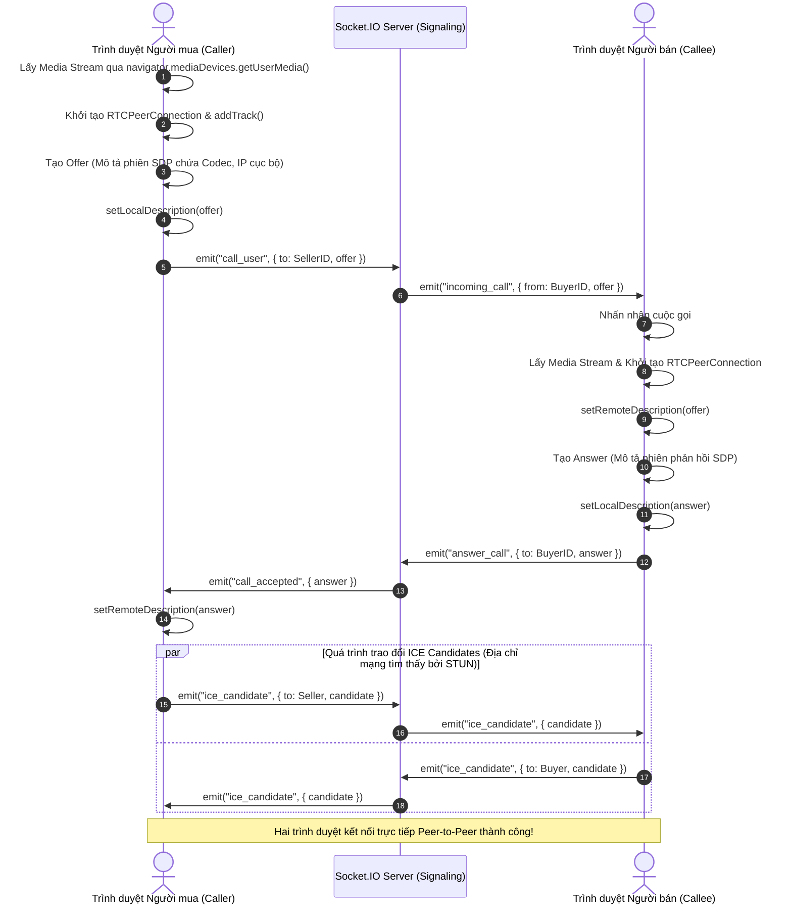
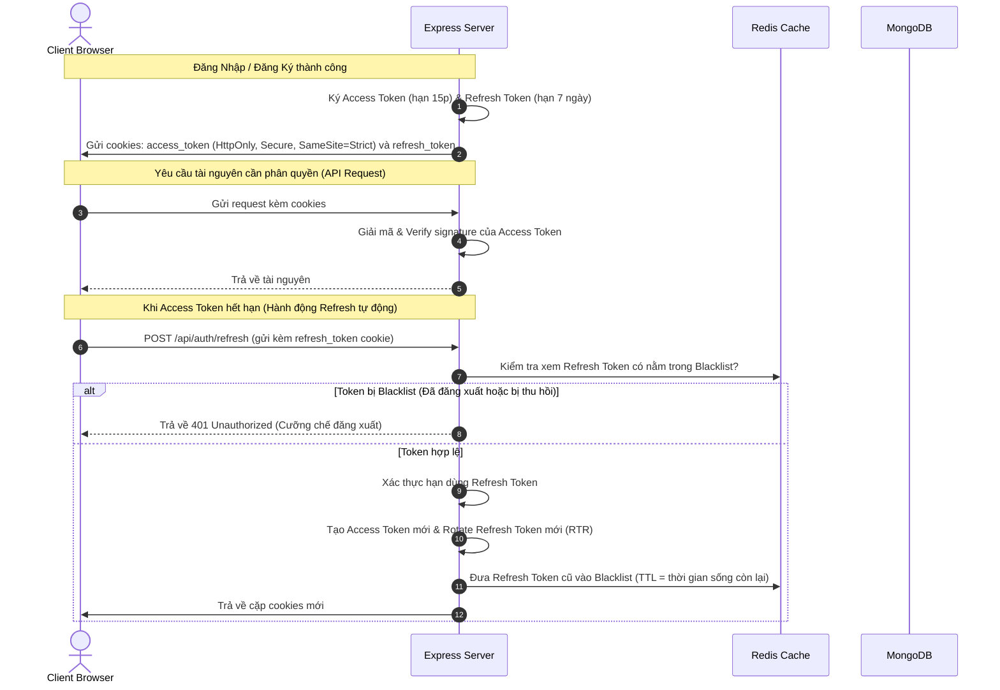
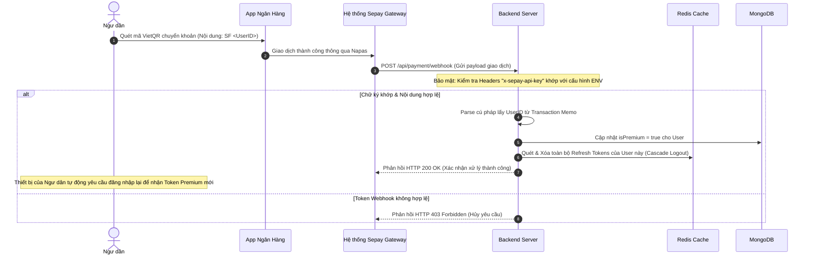
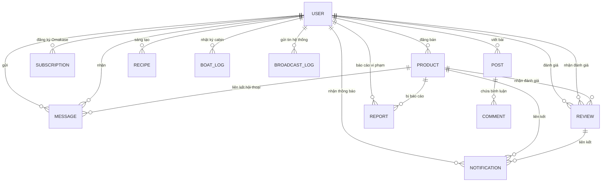

# Chuyên Đề 01: Kiến Trúc & Thiết Kế Hệ Thống Chợ Hải Sản Bản Địa

Chuyên đề này đi sâu phân tích toàn bộ kiến trúc luồng dữ liệu, cách thức vận hành "dưới mui xe" (Under the Hood) của hệ thống **HảiSản.vn**, thiết kế cơ sở dữ liệu chuyên sâu và các cơ chế bảo mật cấp doanh nghiệp.

---

## 1. Cơ Chế Hoạt Động & Giao Tiếp Hệ Thống

Hệ thống hoạt động dựa trên mô hình **3-Tier Architecture** kết hợp hướng sự kiện (**Event-Driven**) thông qua ba kênh giao tiếp chính:

```
                  ┌───────────────────────────────┐
                  │       Client (React SPA)      │
                  └──────┬──────┬──────────┬──────┘
                         │      │          │
        1. REST API (HTTP)      │          │ 3. Media Stream (P2P)
                         │      │          │
                         ▼      │          │
     ┌───────────────────────┐  │          │
     │ Backend (Node Express)│  │ 2. Real-time Events (Socket.IO)
     └───────────────────────┘  │          │
                                ▼          ▼
                    ┌──────────────────────────────┐
                    │      Đối Tác Giao Tiếp       │
                    │   (Seller / Buyer Browser)   │
                    └──────────────────────────────┘
```

1. **RESTful HTTP APIs (Kênh Kéo - Pull)**: Dùng cho các hành động CRUD tĩnh như đăng bài, lấy danh sách công thức, chỉnh sửa hồ sơ.
2. **WebSockets qua Socket.IO (Kênh Đẩy - Push)**: Dùng cho thông báo thời gian thực, cập nhật số tin nhắn chưa đọc và bắt tay báo hiệu (Signaling) cho WebRTC.
3. **WebRTC Peer-to-Peer (Kênh Ngang Hàng)**: Truyền dẫn trực tiếp dữ liệu âm thanh và hình ảnh chất lượng cao giữa hai trình duyệt mà không thông qua máy chủ.

---

## 2. Cơ Chế Cuộc Gọi Video Ngang Hàng (WebRTC Under the Hood)

WebRTC (Web Real-Time Communication) cho phép truyền phát video/audio trực tiếp giữa người mua và người bán. Do các thiết bị thường nằm sau NAT/Firewall, quy trình bắt tay báo hiệu (Signaling) được thực hiện qua Socket.IO:



### Thuật ngữ chuyên sâu:
* **SDP (Session Description Protocol)**: File cấu hình định dạng văn bản mô tả các thông số kỹ thuật của kết nối (loại codec hỗ trợ, băng thông, định dạng media).
* **ICE (Interactive Connectivity Establishment)**: Giao thức tìm kiếm con đường tối ưu nhất để kết nối hai thiết bị.
* **STUN Server (Session Traversal Utilities for NAT)**: Server trung gian giúp trình duyệt tự khám phá ra IP công cộng và Port của chính mình sau NAT.
* **TURN Server (Traversal Using Relays around NAT)**: Server chuyển tiếp media khi kết nối P2P bị chặn hoàn toàn bởi tường lửa đối xứng (Symmetric NAT).

---

## 3. Quy Trình Xác Thực (Authentication Flow)

Hệ thống triển khai cơ chế xác thực **Stateless JWT** kết hợp **Stateful Session Control** qua Redis để cân bằng giữa hiệu năng và bảo mật:



### Đăng ký OTP qua SMS Gateway:
1. Người dùng nhập số điện thoại. Hệ thống sinh mã OTP 6 số ngẫu nhiên qua module `crypto`.
2. Lưu cặp khóa `{ "otp:phone_number": OTP_CODE }` vào Redis với **TTL 5 phút** để tự động hủy khóa nhằm tối ưu bộ nhớ.
3. Backend gọi ESMS Gateway API qua HTTPS POST gửi SMS tới điện thoại người dùng. Khi người dùng xác nhận, backend truy vấn Redis để so khớp giá trị.

---

## 4. Cơ Chế Webhook Của Cổng Thanh Toán Sepay

Để tự động hóa nâng cấp tài khoản Premium cho ngư dân, hệ thống tích hợp Webhook bất đồng bộ:



---

## 5. Thiết Kế Cơ Sở Dữ Liệu Chuyên Sâu

### 5.1 Sơ đồ mối quan hệ thực thể (ERD - Entity Relationship Diagram)



### 5.2 Đặc Tả Schema Chi Tiết Của 11 Collections

#### 1. USER (`users` collection)
Lưu giữ thông tin định danh, vai trò và trạng thái quyền hạn.
* `name` (String, Required): Tên hiển thị.
* `email` (String, Required, Unique, Lowercase): Địa chỉ email đăng nhập.
* `password` (String, Required): Mật khẩu băm Bcrypt (salt rounds = 10).
* `role` (String, Enum: `["User", "Admin"]`, Default: `"User"`): Quyền hạn.
* `isActive` (Boolean, Default: `true`): Cho phép khóa tài khoản.
* `isVerified` (Boolean, Default: `false`): Chứng nhận ngư dân uy tín.
* `isPremium` (Boolean, Default: `false`): Trạng thái tài khoản trả phí.
* `avatar` (String, Nullable): Đường dẫn ảnh lưu trên Cloudinary.
* `favorites` (Array[ObjectId], Ref: `Product`): Danh sách sản phẩm yêu thích.
* `following` (Array[ObjectId], Ref: `User`): Danh sách ngư dân đang theo dõi.

#### 2. PRODUCT (`products` collection)
Mô hình hóa sản phẩm hải sản (loại tươi sống gắn định vị, loại khô có hạn sử dụng).
* `sellerId` (ObjectId, Required, Ref: `User`): Ngư dân đăng bán.
* `type` (String, Enum: `["Fresh", "Dried"]`): Loại hải sản.
* `category` (String, Enum: `["Fish", "Shrimp", "Crab", "Shellfish", "Squid", "Others"]`): Danh mục.
* `name` (String, Required, Trim): Tên sản phẩm.
* `description` (String, Required): Mô tả sản phẩm.
* `price` (Number, Required, Min: 0): Giá bán trên 1 kg.
* `salesType` (String, Enum: `["Retail", "Wholesale"]`): Bán lẻ / Bán sỉ.
* `totalWeight` (Number, Required, Min: 0.1): Khối lượng ban đầu.
* `remainingWeight` (Number, Required, Min: 0): Khối lượng còn lại sau giao dịch.
* `status` (String, Enum: `["Active", "SoldOut", "Expired"]`, Default: `"Active"`).
* `location` (GeoJSON Point, Nullable): Tọa độ địa lý `{ type: "Point", coordinates: [Kinh_độ, Vĩ_độ] }`.
* `catchTime` (Date, Nullable): Thời gian đánh bắt (bắt buộc với sản phẩm tươi).
* `origin` (String, Nullable): Xuất xứ (bắt buộc với sản phẩm khô).
* `expiryDate` (Date, Nullable): Hạn sử dụng (sản phẩm khô).
* `images` (Array[String], Max: 5): Ảnh sản phẩm.
* `priceHistory` (Array[Embedded Object]): Lịch sử biến động giá `{ oldPrice, newPrice, changedAt }`.
* `bumpedAt` (Date, Default: `Date.now`): Thời gian đẩy bài đăng.

#### 3. MESSAGE (`messages` collection)
* `productId` (ObjectId, Required, Ref: `Product`): Sản phẩm làm ngữ cảnh chat.
* `senderId` (ObjectId, Required, Ref: `User`): Người gửi.
* `receiverId` (ObjectId, Required, Ref: `User`): Người nhận.
* `content` (String, Nullable): Nội dung văn bản (đã sanitize XSS).
* `imageUrl` (String, Nullable): Đường dẫn ảnh đính kèm.
* `location` (Object, Nullable): Tọa độ chia sẻ `{ latitude, longitude, address }`.
* `isRead` (Boolean, Default: `false`): Trạng thái xem.

#### 4. REVIEW (`reviews` collection)
* `productId` (ObjectId, Required, Ref: `Product`): Sản phẩm giao dịch.
* `reviewerId` (ObjectId, Required, Ref: `User`): Người mua đánh giá.
* `sellerId` (ObjectId, Required, Ref: `User`): Người bán nhận đánh giá.
* `rating` (Number, Required, Min: 1, Max: 5): Điểm số đánh giá.
* `comment` (String, Nullable): Nội dung nhận xét.
* `imageUrl` (String, Nullable): Ảnh sản phẩm thực tế nhận được.

#### 5. POST (`posts` collection)
* `userId` (ObjectId, Required, Ref: `User`): Tác giả bài viết cộng đồng.
* `title` (String, Required): Tiêu đề.
* `content` (String, Required): Nội dung bài đăng.
* `images` (Array[String]): Bộ ảnh đi kèm.
* `likes` (Array[ObjectId], Ref: `User`): Lượt thích.
* `comments` (Array[Embedded Object]): Bình luận `{ userId, userName, userAvatar, text, createdAt }`.
* `viewCount` (Number, Default: 0): Lượt đọc.

#### 6. RECIPE (`recipes` collection)
* `title` (String, Required): Tên món ăn chế biến.
* `description` (String, Required): Mô tả món ăn.
* `ingredients` (Array[String]): Nguyên liệu.
* `instructions` (Array[String]): Các bước nấu.
* `imageUrl` (String): Ảnh món ăn thành phẩm.
* `authorId` (ObjectId, Required, Ref: `User`): Người đăng công thức.
* `difficulty` (String, Enum: `["Easy", "Medium", "Hard"]`): Độ khó.
* `cookingTime` (Number): Thời gian chế biến (phút).
* `servings` (Number): Định lượng khẩu phần.
* `likes` (Array[ObjectId], Ref: `User`).

#### 7. BOAT_LOG (`boatlogs` collection)
* `userId` (ObjectId, Required, Ref: `User`): Ngư dân viết nhật ký cabin.
* `content` (String, Required): Nội dung hải trình đánh bắt.
* `images` (Array[String]): Ảnh chụp buồng lái, kéo lưới ngoài khơi.
* `likes` (Array[ObjectId], Ref: `User`).

#### 8. REPORT (`reports` collection)
* `reporterId` (ObjectId, Required, Ref: `User`): Người báo cáo.
* `productId` (ObjectId, Required, Ref: `Product`): Tin đăng vi phạm.
* `reason` (String, Required): Lý do báo cáo.
* `status` (String, Enum: `["Pending", "Resolved", "Dismissed"]`): Trạng thái xử lý.
* `adminNote` (String): Phản hồi từ quản trị viên.

#### 9. NOTIFICATION (`notifications` collection)
* `userId` (ObjectId, Required, Ref: `User`): Người nhận thông báo.
* `type` (String, Enum: `["new_message", "new_review", "system"]`): Phân loại.
* `content` (String, Required): Nội dung hiển thị.
* `isRead` (Boolean, Default: `false`).
* `productId`/`reviewId` (ObjectId, Optional): Liên kết ngữ cảnh.

#### 10. SUBSCRIPTION (`subscriptions` collection)
* `userId` (ObjectId, Required, Ref: `User`): Khách hàng đăng ký Omakase.
* `packageType` (String, Enum: `["Small", "Medium", "Large"]`): Phân loại gói.
* `price` (Number, Required): Giá cước gói.
* `frequency` (String, Enum: `["Weekly", "BiWeekly", "Monthly"]`): Chu kỳ giao.
* `preferredDay` (String, Required): Ngày mong muốn nhận hàng trong tuần.
* `shippingAddress` (String, Required): Địa chỉ giao hải sản.
* `phone` (String, Required): Số điện thoại nhận hàng.
* `status` (String, Enum: `["Pending", "Active", "Cancelled"]`).

#### 11. BROADCAST_LOG (`broadcastlogs` collection)
* `adminId` (ObjectId, Required, Ref: `User`): Quản trị viên phát tin nhắn hệ thống.
* `content` (String, Required, Max: 200 ký tự): Nội dung tin nhắn.
* `targetRole` (String, Enum: `["all", "Seller", "Buyer"]`): Đối tượng phân phối.
* `sentCount` (Number): Số tài khoản nhận thành công.

---

## 6. Giải Thích Cơ Chế Chỉ Mục (Indexes) Trong MongoDB

Để hệ thống phản hồi dưới **100ms** khi dữ liệu tăng trưởng lên hàng triệu bản ghi, các chỉ mục được thiết kế và vận hành như sau:

| Tên Chỉ Mục | Cú Pháp Khai Báo | Kiểu Chỉ Mục | Cách Hoạt Động & Ứng Dụng |
| :--- | :--- | :--- | :--- |
| **User Email** | `{ email: 1 }` | `Unique B-Tree` | Tăng tốc tìm kiếm thông tin khi đăng nhập. Ràng buộc `unique` ngăn chặn trùng lặp email ở tầng cơ sở dữ liệu. |
| **GPS Location** | `{ location: "2dsphere" }` | `GeoJSON 2dsphere` | Dành cho việc truy vấn khoảng cách bản đồ. MongoDB sử dụng hệ tọa độ trắc địa Geodetic để tính toán khoảng cách thực tế giữa hai điểm vĩ độ/kinh độ dạng mặt cầu, giúp thực thi toán tử `$near` siêu nhanh. |
| **Product Feed** | `{ status: 1, type: 1, bumpedAt: -1 }` | `Compound Index` | Dùng hiển thị Trang chủ. Chỉ mục ghép này giúp lọc sản phẩm có trạng thái `Active`, phân loại `Fresh`/`Dried` và sắp xếp theo thời điểm đẩy bài mới nhất (`bumpedAt` giảm dần) mà **không gây lỗi in-memory sort** (tránh quá tải RAM của DB). |
| **Full-Text Search** | `{ name: "text", description: "text" }` | `Text Index` | Phục vụ thanh công cụ tìm kiếm. MongoDB tách từ (tokenization), loại bỏ stopwords và đánh chỉ mục đảo ngược (Inverted Index) các từ khóa, hỗ trợ truy vấn tìm kiếm gần đúng với trọng số ưu tiên cho tên sản phẩm. |

---

## 7. Cơ Chế Bảo Mật Toàn Diện

* **Chống Tấn Công CSRF (Cross-Site Request Forgery)**: Hệ thống sử dụng cơ chế **Double Submit Cookie**. Ở mỗi request đầu tiên, server sinh ra một token ngẫu nhiên, ghi vào cookie `csrfToken` (với SameSite=Strict). Khi client gửi request thay đổi dữ liệu (POST/PUT/DELETE), client phải đọc cookie này và gửi kèm trong header `x-csrf-token`. Server so khớp hai giá trị này để đảm bảo request bắt nguồn từ chính ứng dụng React chứ không phải từ bên thứ ba.
* **Chống Rate Limiting (Brute-Force & Denial of Service)**: Tích hợp `express-rate-limit` phân tầng:
  - Lối vào đăng nhập/đăng ký: Giới hạn nghiêm ngặt **20 request / 15 phút** chống dò mật khẩu.
  - Endpoints Polling (như kiểm tra tin nhắn chưa đọc 30 giây/lần): Giới hạn riêng biệt tránh ảnh hưởng đến các request thường.
  - Kênh Chat Socket.IO: Áp dụng Rate Limiting qua Redis pipeline, giới hạn tối đa **5 tin nhắn / 2 giây** để ngăn chặn spam tin nhắn làm nghẽn hạ tầng.
* **Chống NoSQL Injection**: Sử dụng thư viện Mongoose ODM. Mọi tham số truyền vào truy vấn đều được ép kiểu tự động dựa trên Schema định sẵn (ví dụ: ObjectId, Number). Các toán tử NoSQL thô như `$gt`, `$ne` do người dùng truyền lên trong HTTP body sẽ bị vô hiệu hóa hoặc ép kiểu về dạng chuỗi vô hại.
* **CORS (Cross-Origin Resource Sharing)**: Cấu hình CORS chỉ chấp nhận duy nhất nguồn gốc từ biến môi trường `CLIENT_URL` (mặc định là `http://localhost:3000`), có bật thuộc tính `credentials: true` để cho phép truyền nhận cookie an toàn giữa client và backend.
* **Helmet**: Middleware thiết lập các HTTP headers bảo mật (như ẩn thông tin server `X-Powered-By`, bật XSS Protection, hạn chế clickjacking qua Frameguard).
