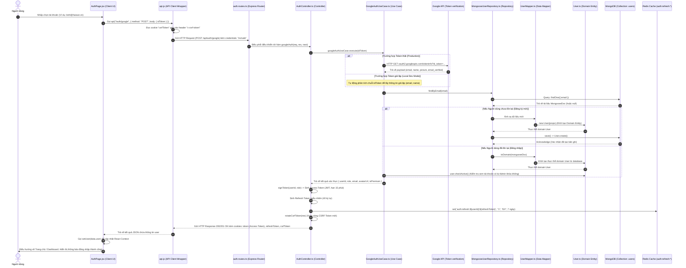
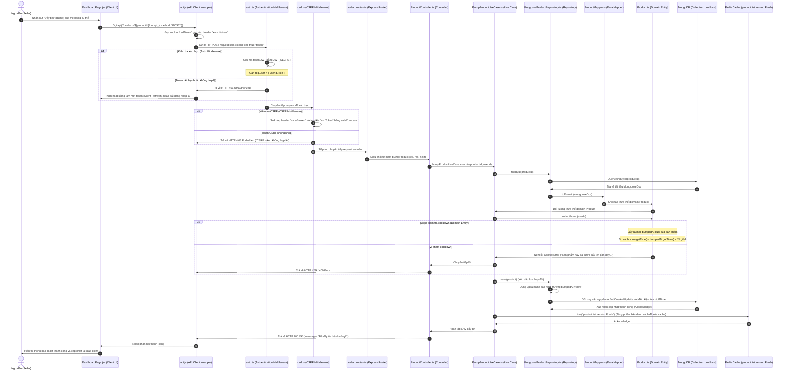
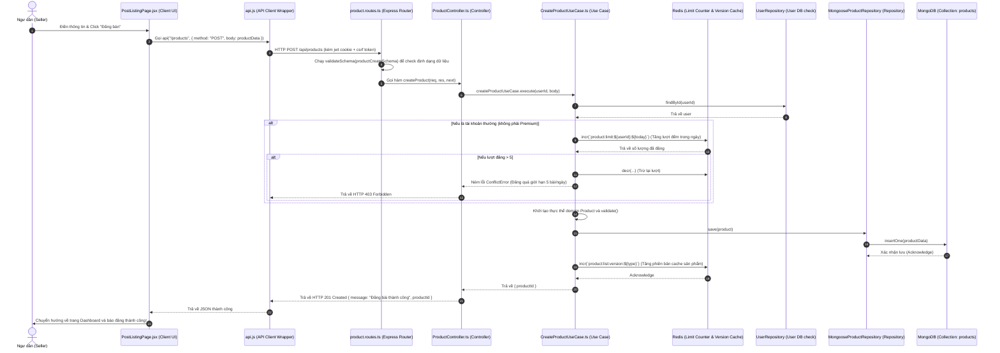
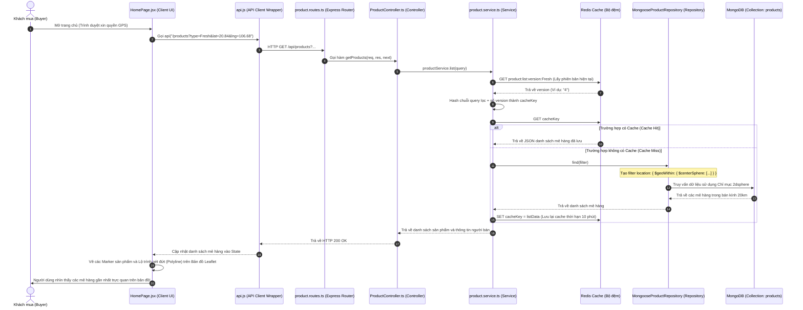
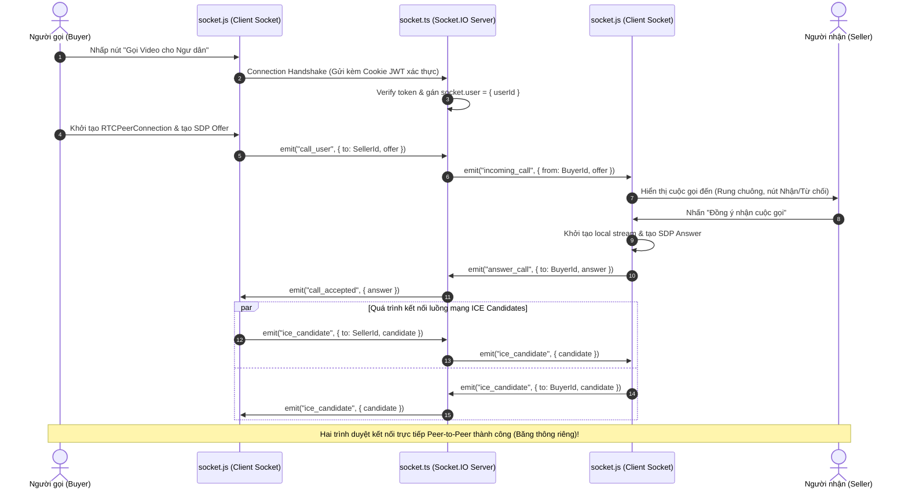
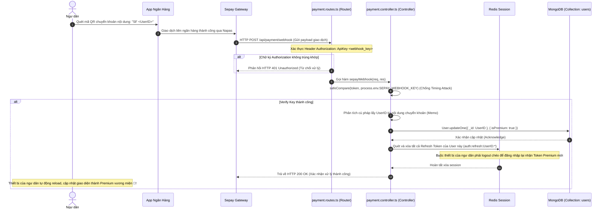
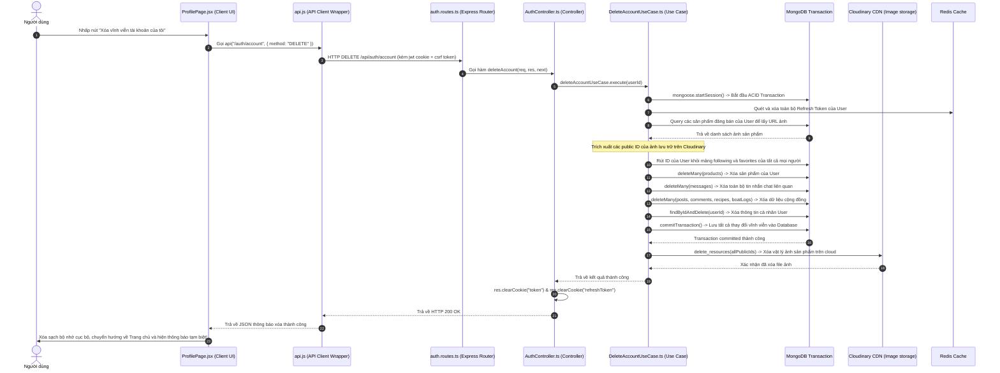

# Chuyên Đề 06: Hướng Dẫn Vòng Đời Use Case & Kiến Trúc Kiểm Thử Tự Động từ A-Z

Tài liệu này được biên soạn nhằm giải thích cặn kẽ cách dự án **HảiSản.vn** vận hành "dưới mui xe" (Under the Hood). Cho dù bạn là người mới bắt đầu học lập trình hay lập trình viên có kinh nghiệm, hướng dẫn này sẽ chỉ rõ từng bước yêu cầu từ trình duyệt của người dùng (User Request) chảy qua những tệp tin nào, lớp code nào xử lý, lưu xuống cơ sở dữ liệu ra sao, và cơ chế kiểm thử tự động của hệ thống hoạt động như thế nào.

---

## 1. Bản Đồ Tổng Quan: Con Đường Đi Của Một Yêu Cầu (Request Flow)

Khi người dùng thực hiện một thao tác trên giao diện (ví dụ: đăng nhập, đăng sản phẩm, bình luận), dữ liệu sẽ đi qua một hành trình phân lớp nghiêm ngặt trước khi được lưu vào cơ sở dữ liệu. 

Dưới đây là sơ đồ Mermaid mô tả hành trình từ giao diện React Client đến cơ sở dữ liệu MongoDB/Redis:

```
[Người dùng (UI Browser)]
       │ (1. Thao tác nhấp chuột / nhập liệu)
       ▼
[React Component (pages/ hoặc components/)]
       │ (2. Gọi hàm API)
       ▼
[api.js (Client API Helper)]
       │ (3. Đính kèm cookies, CSRF token)
       ▼
[Cors / Auth / Csrf Middlewares (Backend Security)]
       │ (4. Xác thực JWT, check Rate Limit, chặn CSRF)
       ▼
[Express Router (routes/*.routes.ts)]
       │ (5. Điều hướng định tuyến URL)
       ▼
[Presentation Controller (presentation/http/*Controller.ts)]
       │ (6. Bóc tách req.body, req.query, req.user)
       ▼
[Application UseCase (application/use-cases/*.ts)]
       │ (7. Điều phối và xử lý logic nghiệp vụ)
       ▼
[Domain Entity / Aggregate Root (domain/entities/*.ts)]
       │ (8. Kiểm tra tính đúng đắn/bất biến của dữ liệu)
       ▼
[Infrastructure Repository (infrastructure/persistence/mongoose/*Repository.ts)]
       │ (9. mapper.toPersistence và lưu trữ vào MongoDB / Redis)
       ▼
[MongoDB / Redis Cache] (Lưu trữ vĩnh viễn / bộ đệm)
```

---

## 2. Bản Đồ Danh Sách Toàn Bộ 23 Use Cases Nghiệp Vụ Trong Dự Án

Để giúp bạn có cái nhìn từ A-Z về mọi ngóc ngách của dự án HảiSản.vn, dưới đây là bảng danh mục toàn bộ **23 Use Cases** đang vận hành trong lõi nghiệp vụ backend, phân tách theo từng Bounded Context (Module):

### 2.1 Phân hệ Định danh & Phân quyền (IAM - 6 Use Cases)
| STT | Tên Use Case | Đường dẫn tệp tin | Mô tả chức năng nghiệp vụ | DB Collections tác động |
| --- | --- | --- | --- | --- |
| 1 | **GoogleAuthUseCase** | [GoogleAuthUseCase.ts](file:///c:/Users/PC/OneDrive/Desktop/sea_shop/sea_shop/swp391-su26-ai-audit-project-swp391_se20a04_group-06/backend/src/modules/iam/application/use-cases/GoogleAuthUseCase.ts) | Xác thực mã token Google OAuth 2.0 hoặc giả lập môi trường Local Dev để đăng nhập nhanh. | `users` |
| 2 | **LoginUseCase** | [LoginUseCase.ts](file:///c:/Users/PC/OneDrive/Desktop/sea_shop/sea_shop/swp391-su26-ai-audit-project-swp391_se20a04_group-06/backend/src/modules/iam/application/use-cases/LoginUseCase.ts) | Đăng nhập bằng Email và mật khẩu truyền thống, kiểm tra mã hóa bcrypt. | `users` |
| 3 | **RegisterUseCase** | [RegisterUseCase.ts](file:///c:/Users/PC/OneDrive/Desktop/sea_shop/sea_shop/swp391-su26-ai-audit-project-swp391_se20a04_group-06/backend/src/modules/iam/application/use-cases/RegisterUseCase.ts) | Đăng ký tài khoản mới cho người dùng với vai trò tương ứng (Buyer hoặc Fisherman). | `users` |
| 4 | **UpdateProfileUseCase** | [UpdateProfileUseCase.ts](file:///c:/Users/PC/OneDrive/Desktop/sea_shop/sea_shop/swp391-su26-ai-audit-project-swp391_se20a04_group-06/backend/src/modules/iam/application/use-cases/UpdateProfileUseCase.ts) | Thay đổi thông tin cá nhân như họ tên, số điện thoại, avatar URL. | `users` |
| 5 | **ChangePasswordUseCase** | [ChangePasswordUseCase.ts](file:///c:/Users/PC/OneDrive/Desktop/sea_shop/sea_shop/swp391-su26-ai-audit-project-swp391_se20a04_group-06/backend/src/modules/iam/application/use-cases/ChangePasswordUseCase.ts) | Xác thực mật khẩu cũ và đổi mật khẩu mới cho người dùng. | `users` |
| 6 | **DeleteAccountUseCase** | [DeleteAccountUseCase.ts](file:///c:/Users/PC/OneDrive/Desktop/sea_shop/sea_shop/swp391-su26-ai-audit-project-swp391_se20a04_group-06/backend/src/modules/iam/application/use-cases/DeleteAccountUseCase.ts) | Xóa vĩnh viễn tài khoản người dùng và thực hiện dọn dẹp bắc cầu (Cascade delete) toàn bộ dữ liệu liên quan (sản phẩm, chat, like, ảnh trên Cloudinary) dưới dạng ACID Transaction. | Tất cả collections |

### 2.2 Phân hệ Tin đăng & Hải sản (Product - 4 Use Cases)
| STT | Tên Use Case | Đường dẫn tệp tin | Mô tả chức năng nghiệp vụ | DB Collections tác động |
| --- | --- | --- | --- | --- |
| 7 | **CreateProductUseCase** | [CreateProductUseCase.ts](file:///c:/Users/PC/OneDrive/Desktop/sea_shop/sea_shop/swp391-su26-ai-audit-project-swp391_se20a04_group-06/backend/src/modules/product/application/use-cases/CreateProductUseCase.ts) | Đăng mẻ hải sản mới bán, xác thực thông tin sản phẩm và GPS, kiểm tra giới hạn đăng bài theo ngày đối với tài khoản thường. | `products`, `users` |
| 8 | **UpdateProductUseCase** | [UpdateProductUseCase.ts](file:///c:/Users/PC/OneDrive/Desktop/sea_shop/sea_shop/swp391-su26-ai-audit-project-swp391_se20a04_group-06/backend/src/modules/product/application/use-cases/UpdateProductUseCase.ts) | Cập nhật thông tin chi tiết mẻ sản phẩm đã đăng bán. | `products` |
| 9 | **DeleteProductUseCase** | [DeleteProductUseCase.ts](file:///c:/Users/PC/OneDrive/Desktop/sea_shop/sea_shop/swp391-su26-ai-audit-project-swp391_se20a04_group-06/backend/src/modules/product/application/use-cases/DeleteProductUseCase.ts) | Xóa mẻ hải sản khỏi sàn, đồng thời xóa các dữ liệu liên kết (reviews, messages, notifications). | `products`, `reviews`, `messages`, `notifications` |
| 10 | **BumpProductUseCase** | [BumpProductUseCase.ts](file:///c:/Users/PC/OneDrive/Desktop/sea_shop/sea_shop/swp391-su26-ai-audit-project-swp391_se20a04_group-06/backend/src/modules/product/application/use-cases/BumpProductUseCase.ts) | Đẩy tin bài đăng của mẻ hàng lên đầu trang, áp dụng cooldown 24h nghiêm ngặt để chống spam tin bài. | `products` |

### 2.3 Phân hệ Diễn đàn & Bài viết Cộng đồng (Post - 5 Use Cases)
| STT | Tên Use Case | Đường dẫn tệp tin | Mô tả chức năng nghiệp vụ | DB Collections tác động |
| --- | --- | --- | --- | --- |
| 11 | **CreatePostUseCase** | [CreatePostUseCase.ts](file:///c:/Users/PC/OneDrive/Desktop/sea_shop/sea_shop/swp391-su26-ai-audit-project-swp391_se20a04_group-06/backend/src/modules/post/application/use-cases/CreatePostUseCase.ts) | Tạo bài đăng mới chia sẻ kinh nghiệm đi biển hoặc đời sống ngư nghiệp của ngư dân. | `posts` |
| 12 | **DeletePostUseCase** | [DeletePostUseCase.ts](file:///c:/Users/PC/OneDrive/Desktop/sea_shop/sea_shop/swp391-su26-ai-audit-project-swp391_se20a04_group-06/backend/src/modules/post/application/use-cases/DeletePostUseCase.ts) | Xóa vĩnh viễn bài đăng của người dùng và toàn bộ bình luận liên kết. | `posts` |
| 13 | **ToggleLikePostUseCase** | [ToggleLikePostUseCase.ts](file:///c:/Users/PC/OneDrive/Desktop/sea_shop/sea_shop/swp391-su26-ai-audit-project-swp391_se20a04_group-06/backend/src/modules/post/application/use-cases/ToggleLikePostUseCase.ts) | Thích hoặc bỏ thích một bài đăng của ngư dân trên diễn đàn. | `posts` |
| 14 | **AddCommentUseCase** | [AddCommentUseCase.ts](file:///c:/Users/PC/OneDrive/Desktop/sea_shop/sea_shop/swp391-su26-ai-audit-project-swp391_se20a04_group-06/backend/src/modules/post/application/use-cases/AddCommentUseCase.ts) | Thêm bình luận dưới bài viết cộng đồng. | `posts` |
| 15 | **DeleteCommentUseCase** | [DeleteCommentUseCase.ts](file:///c:/Users/PC/OneDrive/Desktop/sea_shop/sea_shop/swp391-su26-ai-audit-project-swp391_se20a04_group-06/backend/src/modules/post/application/use-cases/DeleteCommentUseCase.ts) | Gỡ bỏ bình luận của chính mình dưới bài viết. | `posts` |

### 2.4 Phân hệ Cẩm nang Công thức ẩm thực (Recipe - 5 Use Cases)
| STT | Tên Use Case | Đường dẫn tệp tin | Mô tả chức năng nghiệp vụ | DB Collections tác động |
| --- | --- | --- | --- | --- |
| 16 | **CreateRecipeUseCase** | [CreateRecipeUseCase.ts](file:///c:/Users/PC/OneDrive/Desktop/sea_shop/sea_shop/swp391-su26-ai-audit-project-swp391_se20a04_group-06/backend/src/modules/recipe/application/use-cases/CreateRecipeUseCase.ts) | Đăng công thức nấu nướng hải sản mới với danh sách nguyên liệu, hình ảnh và các bước thực hiện. | `recipes` |
| 17 | **UpdateRecipeUseCase** | [UpdateRecipeUseCase.ts](file:///c:/Users/PC/OneDrive/Desktop/sea_shop/sea_shop/swp391-su26-ai-audit-project-swp391_se20a04_group-06/backend/src/modules/recipe/application/use-cases/UpdateRecipeUseCase.ts) | Điều chỉnh các nguyên liệu, hình ảnh hoặc các bước hướng dẫn của công thức đã đăng. | `recipes` |
| 18 | **DeleteRecipeUseCase** | [DeleteRecipeUseCase.ts](file:///c:/Users/PC/OneDrive/Desktop/sea_shop/sea_shop/swp391-su26-ai-audit-project-swp391_se20a04_group-06/backend/src/modules/recipe/application/use-cases/DeleteRecipeUseCase.ts) | Xóa vĩnh viễn công thức nấu ăn khỏi hệ thống. | `recipes` |
| 19 | **ToggleLikeRecipeUseCase** | [ToggleLikeRecipeUseCase.ts](file:///c:/Users/PC/OneDrive/Desktop/sea_shop/sea_shop/swp391-su26-ai-audit-project-swp391_se20a04_group-06/backend/src/modules/recipe/application/use-cases/ToggleLikeRecipeUseCase.ts) | Người dùng thả tim yêu thích hoặc bỏ thích công thức món ăn. | `recipes` |
| 20 | **IncrementRecipeViewsUseCase** | [IncrementRecipeViewsUseCase.ts](file:///c:/Users/PC/OneDrive/Desktop/sea_shop/sea_shop/swp391-su26-ai-audit-project-swp391_se20a04_group-06/backend/src/modules/recipe/application/use-cases/IncrementRecipeViewsUseCase.ts) | Tăng chỉ số lượt xem (views) của bài viết công thức khi người dùng mở xem chi tiết. | `recipes` |

### 2.5 Phân hệ Nhật ký Cabin thuyền trưởng (Boat Log - 3 Use Cases)
| STT | Tên Use Case | Đường dẫn tệp tin | Mô tả chức năng nghiệp vụ | DB Collections tác động |
| --- | --- | --- | --- | --- |
| 21 | **CreateBoatLogUseCase** | [CreateBoatLogUseCase.ts](file:///c:/Users/PC/OneDrive/Desktop/sea_shop/sea_shop/swp391-su26-ai-audit-project-swp391_se20a04_group-06/backend/src/modules/boat-log/application/use-cases/CreateBoatLogUseCase.ts) | Ngư dân viết nhật ký đánh cá ghi nhận tọa độ hành trình trên biển và hình ảnh hoạt động thực tế. | `boatlogs` |
| 22 | **DeleteBoatLogUseCase** | [DeleteBoatLogUseCase.ts](file:///c:/Users/PC/OneDrive/Desktop/sea_shop/sea_shop/swp391-su26-ai-audit-project-swp391_se20a04_group-06/backend/src/modules/boat-log/application/use-cases/DeleteBoatLogUseCase.ts) | Xóa nhật ký đi biển đã đăng. | `boatlogs` |
| 23 | **ToggleLikeBoatLogUseCase** | [ToggleLikeBoatLogUseCase.ts](file:///c:/Users/PC/OneDrive/Desktop/sea_shop/sea_shop/swp391-su26-ai-audit-project-swp391_se20a04_group-06/backend/src/modules/boat-log/application/use-cases/ToggleLikeBoatLogUseCase.ts) | Người theo dõi nhấn thích hoặc bỏ thích nhật ký đi biển của thuyền trưởng. | `boatlogs` |

---

## 3. Vòng Đời Use Case 1: Đăng Nhập Google & Giả Lập Dev (Google/Mock Auth)

### 📌 Mục đích:
Hệ thống cho phép người dùng đăng nhập an toàn bằng tài khoản Google thật thông qua OAuth 2.0 hoặc tài khoản giả lập trên máy cá nhân để tăng tốc độ phát triển dự án (Local Dev Quick Login).

### 📊 Sơ đồ tuần tự Vòng đời hoàn chỉnh (Request & Response Lifecycle)



---

## 4. Vòng Đời Use Case 2: Đẩy Tin Bài Đăng Bán (Bump Product)

### 📌 Mục đích:
Hệ thống cho phép ngư dân đẩy bài viết bán sản phẩm của mình lên đầu bảng tin để tiếp cận khách hàng tốt hơn, tuy nhiên có cơ chế cooldown nghiêm ngặt **24 tiếng** để chống spam bài đăng.

### 📊 Sơ đồ tuần tự Vòng đời hoàn chỉnh (Request & Response Lifecycle)



---

## 5. Vòng Đời Use Case 3: Đăng Bán Mẻ Hải Sản Mới (Create Product)

### 📌 Mục đích:
Cho phép ngư dân đăng bán các mẻ hải sản mới (Tươi hoặc Khô). Nếu là hàng tươi (`Fresh`), hệ thống bắt buộc phải thu nhận định vị tọa độ GPS để người mua tìm thấy mẻ hàng gần nhất. Để tránh spam, người dùng thường bị giới hạn đăng tối đa 5 tin một ngày (Premium không giới hạn).

### 📊 Sơ đồ tuần tự Vòng đời hoàn chỉnh (Request & Response Lifecycle)



---

## 6. Vòng Đời Use Case 4: Lọc & Tìm Kiếm Theo GPS và Từ Khóa (List Products)

### 📌 Mục đích:
Khách hàng mua hải sản có thể tìm thấy các mẻ hàng tươi xung quanh mình trong bán kính tối đa 20km sử dụng GPS, hoặc tìm kiếm hải sản theo tên/mô tả sử dụng Text Index. Ứng dụng tích hợp bộ đệm cache Redis thông minh giúp giảm tải truy vấn MongoDB và phản hồi dưới 100ms.

### 📊 Sơ đồ tuần tự Vòng đời hoàn chỉnh (Request & Response Lifecycle)



---

## 7. Vòng Đời Use Case 5: Bắt Tay Báo Hiệu Cuộc Gọi Video (WebRTC Video Call Signaling)

### 📌 Mục đích:
Hỗ trợ cuộc gọi video trực tuyến thời gian thực giữa Người mua và Người bán để trực tiếp kiểm tra độ tươi sống của mẻ cá trên thuyền. WebRTC truyền dẫn media trực tiếp (Peer-to-Peer), nhưng cần server WebSocket (Socket.IO) làm trung gian trao đổi thông số cấu hình mạng ban đầu.

### 📊 Sơ đồ tuần tự Vòng đời hoàn chỉnh (Request & Response Lifecycle)



---

## 8. Vòng Đời Use Case 6: Nâng Cấp Premium Tự Động Qua Sepay Webhook

### 📌 Mục đích:
Khi ngư dân muốn đăng tin bán không giới hạn và nhận huy hiệu vương miện Premium uy tín, họ sẽ quét mã VietQR chuyển khoản nâng cấp tài khoản. Hệ thống nhận webhook thanh toán từ đối tác Sepay, xác thực chữ ký bảo mật và tự động nâng cấp thời gian thực.

### 📊 Sơ đồ tuần tự Vòng đời hoàn chỉnh (Request & Response Lifecycle)



---

## 9. Vòng Đời Use Case 7: Xóa Tài Khoản GDPR Cascade (Quyền Được Quên)

### 📌 Mục đích:
Tuân thủ luật bảo vệ quyền riêng tư người dùng nghiêm ngặt (GDPR). Khi người dùng yêu cầu xóa tài khoản, hệ thống sẽ thực hiện xóa bắc cầu (Cascade Delete) toàn bộ các dữ liệu liên quan (tin nhắn, bài đăng, công thức nấu ăn, nhật ký đi biển, file ảnh trên Cloudinary) dưới dạng một MongoDB Transaction an toàn để đảm bảo không để lại dữ liệu mồ côi.

### 📊 Sơ đồ tuần tự Vòng đời hoàn chỉnh (Request & Response Lifecycle)



---

## 10. Hệ Thống Kiểm Thử Tự Động (Jest Testing Guide)

Kiểm thử tự động giúp nhà phát triển tự tin thay đổi mã nguồn mà không sợ làm hỏng các tính năng cũ đang chạy tốt. Dự án sử dụng framework **Jest** kết hợp **ts-jest** để biên dịch TypeScript động khi kiểm thử.

### 10.1 Cấu hình kiểm thử Jest (`jest.config.js`)
* **Tệp tin**: [jest.config.js](file:///c:/Users/PC/OneDrive/Desktop/sea_shop/sea_shop/swp391-su26-ai-audit-project-swp391_se20a04_group-06/backend/jest.config.js)
* **Ý nghĩa cấu hình**:
  - `preset: "ts-jest"`: Hướng dẫn Jest tự động dịch code `.ts` sang `.js` trong bộ nhớ RAM khi chạy thử nghiệm.
  - `testEnvironment: "node"`: Chạy môi trường Node.js tách biệt, không cần khởi động trình duyệt.
  - `testMatch: ["**/*.test.ts"]`: Jest sẽ chỉ tìm và chạy các file có chứa từ `.test.ts`.

---

### 10.2 Bản chất của cơ chế Giả Lập (Mocking Dependencies)
> **❓ Câu hỏi**: Tại sao không kết nối trực tiếp vào MongoDB hay gửi email thật khi chạy test?
> 
> **💡 Trả lời**: Chạy thử nghiệm cần diễn ra cực kỳ nhanh (dưới 5 giây). Nếu kết nối vào cơ sở dữ liệu thật, dữ liệu rác sẽ làm bẩn database, đồng thời làm chậm tiến trình và phụ thuộc vào kết nối Internet. Do đó, chúng ta sử dụng cơ chế **Mocking** (tạo lập các vật thế thân giả lập) bằng cách khai báo ở đầu file test:
```typescript
jest.mock("../repositories/user.repository");
jest.mock("../config/redis", () => ({
  redis: {
    get: jest.fn(),
    set: jest.fn(),
    incr: jest.fn()
  }
}));
```
Đoạn code trên sẽ biến toàn bộ các hàm gọi database và Redis thành các hàm rỗng (`jest.fn()`). Chúng ta có thể chủ động cấu hình kết quả trả về giả định cho chúng để kiểm tra xem code của ta phản ứng như thế nào.

---

### 10.3 Phân Tích Code File Test Mẫu 1: `admin.service.test.ts`
* **Tệp tin**: [admin.service.test.ts](file:///c:/Users/PC/OneDrive/Desktop/sea_shop/sea_shop/swp391-su26-ai-audit-project-swp391_se20a04_group-06/backend/src/services/admin.service.test.ts)
* **Logic kiểm thử khóa tài khoản của Admin**:

```typescript
it("Nên báo lỗi 404 nếu không tìm thấy thông tin tài khoản người dùng cần xử lý", async () => {
  // 1. Dàn dựng bối cảnh: Giả lập repository trả về null (không tìm thấy user)
  (userRepository.findRawById as jest.Mock).mockResolvedValue(null);

  // 2. Chạy & Kiểm tra kết quả: AdminService phải từ chối xử lý và ném lỗi 404
  await expect(adminService.toggleUserActive(mockUserId)).rejects.toThrow(
    expect.objectContaining({
      status: 404,
      message: "Không tìm thấy người dùng",
    })
  );
});
```

* **Phân tích luồng thành công**:
```typescript
it("Nên đảo trạng thái hoạt động của tài khoản thành công", async () => {
  // 1. Giả lập tìm thấy tài khoản đang hoạt động (isActive = true)
  (userRepository.findRawById as jest.Mock).mockResolvedValue({
    _id: mockUserId,
    isActive: true,
  });

  // 2. Giả lập lưu thành công trạng thái mới là đã khóa (isActive = false)
  (userRepository.updateActiveStatus as jest.Mock).mockResolvedValue({
    isActive: false,
  });

  // 3. Thực thi hàm
  const result = await adminService.toggleUserActive(mockUserId);

  // 4. Khẳng định (Assertions)
  expect(result).toBe(false); // Kết quả trả về phải là trạng thái mới (false - đã khóa)
  expect(userRepository.updateActiveStatus).toHaveBeenCalledWith(mockUserId, false); // Xác nhận repository đã được gọi đúng tham số
});
```

---

### 10.4 Phân Tích Code File Test Mẫu 2: `product.service.test.ts`
* **Tệp tin**: [product.service.test.ts](file:///c:/Users/PC/OneDrive/Desktop/sea_shop/sea_shop/swp391-su26-ai-audit-project-swp391_se20a04_group-06/backend/src/services/product.service.test.ts)
* **Logic kiểm thử bộ lọc địa lý trắc địa GPS**:

```typescript
it("Nên áp dụng bộ lọc $geoWithin khi truy vấn sản phẩm loại Fresh với lat và lng hợp lệ", async () => {
  // 1. Thực thi hàm tìm kiếm sản phẩm tươi kèm tọa độ GPS
  await productService.list({
    type: "Fresh",
    lat: "20.8449",
    lng: "106.6881",
  });

  // 2. Khẳng định: Hệ thống phải gọi repository tìm kiếm chứa toán tử $geoWithin
  expect(productRepository.find).toHaveBeenCalledWith(
    expect.objectContaining({
      type: "Fresh",
      location: expect.objectContaining({
        $geoWithin: expect.objectContaining({
          $centerSphere: expect.any(Array), // Vẽ bán kính vòng tròn mặt cầu trái đất
        }),
      }),
    }),
    expect.any(Object),
    expect.any(Object)
  );
});
```

---

### 10.5 Các lệnh vận hành kiểm thử

Để chạy kiểm thử và theo dõi kết quả, hãy di chuyển vào thư mục `backend/` và mở cửa sổ Terminal:

1. **Chạy toàn bộ các ca kiểm thử**:
   ```bash
   npm run test
   ```
2. **Chạy test và xuất báo cáo tỷ lệ bao phủ code (Coverage Report)**:
   ```bash
   npm run test:cov
   ```
   *Sau khi chạy xong, Jest sẽ sinh thư mục `backend/coverage/`. Hãy mở tệp tin [index.html](file:///c:/Users/PC/OneDrive/Desktop/sea_shop/sea_shop/swp391-su26-ai-audit-project-swp391_se20a04_group-06/backend/coverage/lcov-report/index.html) bằng trình duyệt web để xem chi tiết biểu đồ màu báo cáo xem dòng code nào đã được chạy qua và dòng nào chưa.*
