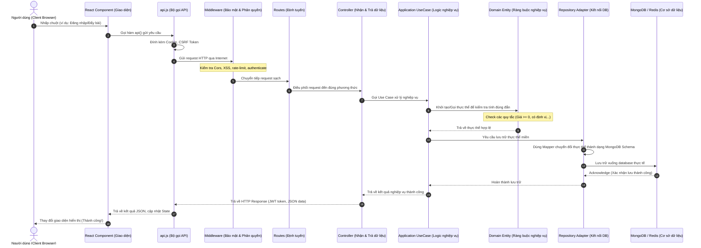

# Chuyên Đề 06: Hướng Dẫn Vòng Đời Use Case & Kiến Trúc Kiểm Thử Tự Động từ A-Z

Tài liệu này được biên soạn nhằm giải thích cặn kẽ cách dự án **HảiSản.vn** vận hành "dưới mui xe" (Under the Hood). Cho dù bạn là người mới bắt đầu học lập trình hay lập trình viên có kinh nghiệm, hướng dẫn này sẽ chỉ rõ từng bước yêu cầu từ trình duyệt của người dùng (User Request) chảy qua những tệp tin nào, lớp code nào xử lý, lưu xuống cơ sở dữ liệu ra sao, và cơ chế kiểm thử tự động của hệ thống hoạt động như thế nào.

---

## 1. Bản Đồ Tổng Quan: Con Đường Đi Của Một Yêu Cầu (Request Flow)

Khi người dùng thực hiện một thao tác trên giao diện (ví dụ: đăng nhập, đăng sản phẩm, bình luận), dữ liệu sẽ đi qua một hành trình phân lớp nghiêm ngặt trước khi được lưu vào cơ sở dữ liệu. 

Dưới đây là sơ đồ Mermaid mô tả hành trình từ giao diện React Client đến cơ sở dữ liệu MongoDB/Redis:



---

## 2. Phân Tích Chi Tiết Vòng Đời Use Case 1: Đăng Nhập Google & Giả Lập Dev (Google/Mock Auth)

### 📌 Mục đích:
Hệ thống cho phép người dùng đăng nhập an toàn bằng tài khoản Google thật thông qua OAuth 2.0 hoặc tài khoản giả lập trên máy cá nhân để tăng tốc độ phát triển dự án (Local Dev Quick Login).

---

### 🏃‍♂️ Hành trình từng dòng code cụ thể:

#### Bước 1: Trình duyệt gửi yêu cầu đăng nhập
* **Tệp tin**: [AuthPage.jsx](file:///c:/Users/PC/OneDrive/Desktop/sea_shop/sea_shop/swp391-su26-ai-audit-project-swp391_se20a04_group-06/client/src/pages/AuthPage.jsx)
* **Dòng code tham gia**: Hàm `selectMockAccount` (dòng 120-144) hoặc `handleGoogleCredentialResponse` (dòng 53-71).
* **Nhiệm vụ**: Khi người dùng nhấn nút chọn tài khoản dev `binh@haisan.vn`, hàm này gửi yêu cầu POST đến backend bằng cách gọi:
  ```javascript
  const data = await api("/auth/google", {
    method: "POST",
    body: JSON.stringify({ idToken: "mock_google_token_binh@haisan.vn_..." })
  });
  ```

#### Bước 2: Đính kèm CSRF token và Header bảo mật
* **Tệp tin**: [api.js](file:///c:/Users/PC/OneDrive/Desktop/sea_shop/sea_shop/swp391-su26-ai-audit-project-swp391_se20a04_group-06/client/src/services/api.js)
* **Dòng code tham gia**: Đọc token CSRF từ cookie và thiết lập `credentials: "include"`.
* **Nhiệm vụ**: Đảm bảo tất cả các cuộc gọi thay đổi dữ liệu được đính kèm token bảo mật chống hack chéo trang (CSRF), đồng thời cho phép trình duyệt tự động đính kèm Cookie xác thực.

#### Bước 3: Định tuyến request trên Backend
* **Tệp tin**: [auth.routes.ts](file:///c:/Users/PC/OneDrive/Desktop/sea_shop/sea_shop/swp391-su26-ai-audit-project-swp391_se20a04_group-06/backend/src/routes/auth.routes.ts)
* **Dòng code tham gia**: `router.post("/google", googleAuth);` (dòng 143).
* **Nhiệm vụ**: Tiếp nhận yêu cầu gửi đến `/api/auth/google` và chuyển tiếp điều phối tới phương thức `googleAuth` của controller.

#### Bước 4: Presentation Layer tiếp nhận dữ liệu
* **Tệp tin**: [AuthController.ts](file:///c:/Users/PC/OneDrive/Desktop/sea_shop/sea_shop/swp391-su26-ai-audit-project-swp391_se20a04_group-06/backend/src/modules/iam/presentation/http/AuthController.ts)
* **Dòng code tham gia**: Phương thức `googleAuth` (dòng 315-342).
* **Nhiệm vụ**: 
  - Đọc `idToken` từ `req.body`.
  - Gọi Use Case nghiệp vụ: `const authResult = await googleAuthUseCase.execute(idToken);`.
  - Nhận lại thông tin định danh và thực hiện các hành động bảo mật: ký token Access Token (`signToken`), tạo Refresh Token ngẫu nhiên, lưu session vào Redis Cache, thiết lập cookie HTTP-only trả về client.

#### Bước 5: Application Layer xử lý logic xác thực Google
* **Tệp tin**: [GoogleAuthUseCase.ts](file:///c:/Users/PC/OneDrive/Desktop/sea_shop/sea_shop/swp391-su26-ai-audit-project-swp391_se20a04_group-06/backend/src/modules/iam/application/use-cases/GoogleAuthUseCase.ts)
* **Dòng code tham gia**: Phương thức `execute(idToken)` (dòng 9-107).
* **Nhiệm vụ**:
  - Nếu ở môi trường local development và token bắt đầu bằng `mock_google_token_`: Bỏ qua việc gọi lên máy chủ Google, tự động bóc tách chuỗi để lấy Email và sinh tài khoản giả lập.
  - Nếu ở môi trường thực tế (production): Gửi request đến API chính thức của Google `https://oauth2.googleapis.com/tokeninfo` để kiểm tra độ tin cậy của token, lấy ra Tên, Email, Ảnh đại diện.
  - Truy vấn database để tìm user bằng Email: `let user = await this.userRepository.findByEmail(email);`.
  - **Tạo mới tài khoản nếu chưa tồn tại**: Gọi khởi tạo thực thể miền `User` mới và lưu trữ.

#### Bước 6: Domain Layer áp dụng các ràng buộc nghiệp vụ
* **Tệp tin**: [User.ts](file:///c:/Users/PC/OneDrive/Desktop/sea_shop/sea_shop/swp391-su26-ai-audit-project-swp391_se20a04_group-06/backend/src/modules/iam/domain/entities/User.ts)
* **Nhiệm vụ**: Lớp Domain Entity quản lý quy trình kiểm tra các thuộc tính của User (như email định dạng đúng, tài khoản đang hoạt động thông qua `checkActive()`). Đây là lõi nghiệp vụ bất biến, độc lập với cơ sở dữ liệu.

#### Bước 7: Infrastructure Layer thực hiện lưu xuống MongoDB
* **Tệp tin**: [MongooseUserRepository.ts](file:///c:/Users/PC/OneDrive/Desktop/sea_shop/sea_shop/swp391-su26-ai-audit-project-swp391_se20a04_group-06/backend/src/modules/iam/infrastructure/persistence/mongoose/MongooseUserRepository.ts)
* **Dòng code tham gia**: Phương thức `save(user)` và mapper [UserMapper.ts](file:///c:/Users/PC/OneDrive/Desktop/sea_shop/sea_shop/swp391-su26-ai-audit-project-swp391_se20a04_group-06/backend/src/modules/iam/infrastructure/persistence/mongoose/mappers/UserMapper.ts).
* **Nhiệm vụ**: Chuyển đổi đối tượng domain `User` thành định dạng tài liệu lưu trữ MongoDB và chạy câu lệnh `User.updateOne(...)` lưu vào database.

#### Bước 8: Trả về client và cập nhật trạng thái
* **Nhiệm vụ**: 
  - Browser nhận response HTTP 200 kèm các cookie bảo mật (`token` và `refreshToken`).
  - React Context [AuthProvider.jsx](file:///c:/Users/PC/OneDrive/Desktop/sea_shop/sea_shop/swp391-su26-ai-audit-project-swp391_se20a04_group-06/client/src/context/AuthProvider.jsx) cập nhật trạng thái `setUser(data.user)`.
  - Điều hướng người dùng về trang Dashboard (nếu là Admin) hoặc Trang chủ (nếu là User thường).

---

## 3. Phân Tích Chi Tiết Vòng Đời Use Case 2: Đẩy Tin Bài Đăng Bán (Bump Product)

### 📌 Mục đích:
Hệ thống cho phép ngư dân đẩy bài viết bán sản phẩm của mình lên đầu bảng tin để tiếp cận khách hàng tốt hơn, tuy nhiên có cơ chế cooldown nghiêm ngặt **24 tiếng** để chống spam bài đăng.

---

### 🏃‍♂️ Hành trình từng dòng code cụ thể:

#### Bước 1: Ngư dân nhấp nút "Đẩy bài" trên Giao diện
* **Tệp tin**: [DashboardPage.jsx](file:///c:/Users/PC/OneDrive/Desktop/sea_shop/sea_shop/swp391-su26-ai-audit-project-swp391_se20a04_group-06/client/src/pages/DashboardPage.jsx)
* **Nhiệm vụ**: Phát đi một request HTTP POST:
  ```javascript
  await api(`/products/${productId}/bump`, { method: "POST" });
  ```

#### Bước 2: Middleware kiểm tra bảo mật
* **Tệp tin**: [auth.ts](file:///c:/Users/PC/OneDrive/Desktop/sea_shop/sea_shop/swp391-su26-ai-audit-project-swp391_se20a04_group-06/backend/src/middlewares/auth.ts) và [csrf.ts](file:///c:/Users/PC/OneDrive/Desktop/sea_shop/sea_shop/swp391-su26-ai-audit-project-swp391_se20a04_group-06/backend/src/middlewares/csrf.ts)
* **Nhiệm vụ**: 
  - `authenticate`: Giải mã token JWT từ cookie, lấy thông tin `userId` và `role` gán vào `req.user`. Nếu không đăng nhập, lập tức trả lỗi 401.
  - `validateCsrf`: Kiểm tra tính trùng khớp của token CSRF trong header và cookie để chặn đứng tin tặc.

#### Bước 3: Định tuyến và tiếp nhận Request ở Controller
* **Tệp tin**: [product.routes.ts](file:///c:/Users/PC/OneDrive/Desktop/sea_shop/sea_shop/swp391-su26-ai-audit-project-swp391_se20a04_group-06/backend/src/routes/product.routes.ts) & [ProductController.ts](file:///c:/Users/PC/OneDrive/Desktop/sea_shop/sea_shop/swp391-su26-ai-audit-project-swp391_se20a04_group-06/backend/src/modules/product/presentation/http/ProductController.ts)
* **Dòng code tham gia**: Phương thức `bumpProduct` (dòng 117-126).
* **Nhiệm vụ**: Lấy `id` sản phẩm từ URL và `userId` của ngư dân từ token xác thực, sau đó gọi Use Case: `await bumpProductUseCase.execute(id, userId);`.

#### Bước 4: Kiểm tra điều kiện Cooldown tại Service Layer
* **Tệp tin**: [product.service.ts](file:///c:/Users/PC/OneDrive/Desktop/sea_shop/sea_shop/swp391-su26-ai-audit-project-swp391_se20a04_group-06/backend/src/services/product.service.ts)
* **Dòng code tham gia**: Phương thức `bump(id, userId)` (dòng 667-700).
* **Nhiệm vụ**:
  - Lấy thông tin bài đăng hiện thời từ repository.
  - Tính toán thời gian hết hạn chờ: `const cutoffTime = new Date(Date.now() - 24 * 3600 * 1000);` (đúng 24 giờ trước).
  - Gửi lệnh cập nhật có điều kiện nguyên tử (Atomic Update) xuống database:
    ```typescript
    const updated = await productRepository.findOneAndUpdate(
      {
        _id: id,
        sellerId: userId,
        $or: [
          { bumpedAt: { $lte: cutoffTime } },
          { bumpedAt: { $exists: false } }
        ]
      },
      { $set: { bumpedAt: new Date() } }
    );
    ```
  - **Phân tích logic nguyên tử**: Nếu bài đăng mới được đẩy dưới 24 giờ trước, mốc `bumpedAt` thực tế của nó sẽ lớn hơn `cutoffTime`. Khi đó, câu lệnh tìm kiếm của MongoDB không tìm thấy bản ghi nào thỏa mãn điều kiện lọc. Kết quả `updated` trả về là `null` hoặc rỗng → Hệ thống lập tức ném ra lỗi `HTTP 429 Too Many Requests` báo bài viết chưa hồi chiêu.

#### Bước 5: Làm mới Cache phiên bản trên Redis
* **Tệp tin**: [product.service.ts](file:///c:/Users/PC/OneDrive/Desktop/sea_shop/sea_shop/swp391-su26-ai-audit-project-swp391_se20a04_group-06/backend/src/services/product.service.ts) (dòng 699).
* **Dòng code tham gia**: `await redisIncr("product:list:version:Fresh");` (hoặc `Dried`).
* **Nhiệm vụ**: Nhằm phục vụ hiển thị siêu tốc, danh sách sản phẩm được lưu đệm trong bộ nhớ cache Redis. Khi bài đăng được đẩy lên đầu trang, danh sách hiển thị đã thay đổi. Bằng cách tăng biến số phiên bản danh sách sản phẩm lên 1 đơn vị, tất cả các request lấy danh sách sau đó của người dùng khác sẽ phát hiện cache đã lỗi thời, tự động xóa cache cũ và truy xuất dữ liệu mới nhất từ MongoDB.

---

## 4. Hệ Thống Kiểm Thử Tự Động (Jest Testing Guide)

Kiểm thử tự động giúp nhà phát triển tự tin thay đổi mã nguồn mà không sợ làm hỏng các tính năng cũ đang chạy tốt. Dự án sử dụng framework **Jest** kết hợp **ts-jest** để biên dịch TypeScript động khi kiểm thử.

### 4.1 Cấu hình kiểm thử Jest (`jest.config.js`)
* **Tệp tin**: [jest.config.js](file:///c:/Users/PC/OneDrive/Desktop/sea_shop/sea_shop/swp391-su26-ai-audit-project-swp391_se20a04_group-06/backend/jest.config.js)
* **Ý nghĩa cấu hình**:
  - `preset: "ts-jest"`: Hướng dẫn Jest tự động dịch code `.ts` sang `.js` trong bộ nhớ RAM khi chạy thử nghiệm.
  - `testEnvironment: "node"`: Chạy môi trường Node.js tách biệt, không cần khởi động trình duyệt.
  - `testMatch: ["**/*.test.ts"]`: Jest sẽ chỉ tìm và chạy các file có chứa từ `.test.ts`.

---

### 4.2 Bản chất của cơ chế Giả Lập (Mocking Dependencies)
> **❓ Câu hỏi**: Tại sao không kết nối trực tiếp vào MongoDB hay gửi email thật khi chạy test?
> 
> **💡 Trả lời**: Chạy thử nghiệm cần diễn ra cực kỳ nhanh (dưới 5 giây). Nếu kết nối vào cơ sở dữ liệu thật, dữ liệu rác sẽ làm bẩn database, đồng thời làm chậm tiến trình và phụ thuộc vào kết nối Internet. Do đó, chúng ta sử dụng cơ chế **Mocking** (tạo lập các vật thế thân giả lập) bằng cách khai báo ở đầu file test:
```typescript
jest.mock("../repositories/user.repository");
jest.mock("../config/redis", () => ({
  redis: {
    get: jest.fn(),
    set: jest.fn(),
    incr: jest.fn()
  }
}));
```
Đoạn code trên sẽ biến toàn bộ các hàm gọi database và Redis thành các hàm rỗng (`jest.fn()`). Chúng ta có thể chủ động cấu hình kết quả trả về giả định cho chúng để kiểm tra xem code của ta phản ứng như thế nào.

---

### 4.3 Phân Tích Code File Test Mẫu 1: `admin.service.test.ts`
* **Tệp tin**: [admin.service.test.ts](file:///c:/Users/PC/OneDrive/Desktop/sea_shop/sea_shop/swp391-su26-ai-audit-project-swp391_se20a04_group-06/backend/src/services/admin.service.test.ts)
* **Logic kiểm thử khóa tài khoản của Admin**:

```typescript
it("Nên báo lỗi 404 nếu không tìm thấy thông tin tài khoản người dùng cần xử lý", async () => {
  // 1. Dàn dựng bối cảnh: Giả lập repository trả về null (không tìm thấy user)
  (userRepository.findRawById as jest.Mock).mockResolvedValue(null);

  // 2. Chạy & Kiểm tra kết quả: AdminService phải từ chối xử lý và ném lỗi 404
  await expect(adminService.toggleUserActive(mockUserId)).rejects.toThrow(
    expect.objectContaining({
      status: 404,
      message: "Không tìm thấy người dùng",
    })
  );
});
```

* **Phân tích luồng thành công**:
```typescript
it("Nên đảo trạng thái hoạt động của tài khoản thành công", async () => {
  // 1. Giả lập tìm thấy tài khoản đang hoạt động (isActive = true)
  (userRepository.findRawById as jest.Mock).mockResolvedValue({
    _id: mockUserId,
    isActive: true,
  });

  // 2. Giả lập lưu thành công trạng thái mới là đã khóa (isActive = false)
  (userRepository.updateActiveStatus as jest.Mock).mockResolvedValue({
    isActive: false,
  });

  // 3. Thực thi hàm
  const result = await adminService.toggleUserActive(mockUserId);

  // 4. Khẳng định (Assertions)
  expect(result).toBe(false); // Kết quả trả về phải là trạng thái mới (false - đã khóa)
  expect(userRepository.updateActiveStatus).toHaveBeenCalledWith(mockUserId, false); // Xác nhận repository đã được gọi đúng tham số
});
```

---

### 4.4 Phân Tích Code File Test Mẫu 2: `product.service.test.ts`
* **Tệp tin**: [product.service.test.ts](file:///c:/Users/PC/OneDrive/Desktop/sea_shop/sea_shop/swp391-su26-ai-audit-project-swp391_se20a04_group-06/backend/src/services/product.service.test.ts)
* **Logic kiểm thử bộ lọc địa lý trắc địa GPS**:

```typescript
it("Nên áp dụng bộ lọc $geoWithin khi truy vấn sản phẩm loại Fresh với lat và lng hợp lệ", async () => {
  // 1. Thực thi hàm tìm kiếm sản phẩm tươi kèm tọa độ GPS
  await productService.list({
    type: "Fresh",
    lat: "20.8449",
    lng: "106.6881",
  });

  // 2. Khẳng định: Hệ thống phải gọi repository tìm kiếm chứa toán tử $geoWithin
  expect(productRepository.find).toHaveBeenCalledWith(
    expect.objectContaining({
      type: "Fresh",
      location: expect.objectContaining({
        $geoWithin: expect.objectContaining({
          $centerSphere: expect.any(Array), // Vẽ bán kính vòng tròn mặt cầu trái đất
        }),
      }),
    }),
    expect.any(Object),
    expect.any(Object)
  );
});
```

---

### 4.5 Các lệnh vận hành kiểm thử

Để chạy kiểm thử và theo dõi kết quả, hãy di chuyển vào thư mục `backend/` và mở cửa sổ Terminal:

1. **Chạy toàn bộ các ca kiểm thử**:
   ```bash
   npm run test
   ```
2. **Chạy test và xuất báo cáo tỷ lệ bao phủ code (Coverage Report)**:
   ```bash
   npm run test:cov
   ```
   *Sau khi chạy xong, Jest sẽ sinh thư mục `backend/coverage/`. Hãy mở tệp tin [index.html](file:///c:/Users/PC/OneDrive/Desktop/sea_shop/sea_shop/swp391-su26-ai-audit-project-swp391_se20a04_group-06/backend/coverage/lcov-report/index.html) bằng trình duyệt web để xem chi tiết biểu đồ màu báo cáo xem dòng code nào đã được chạy qua và dòng nào chưa.*
