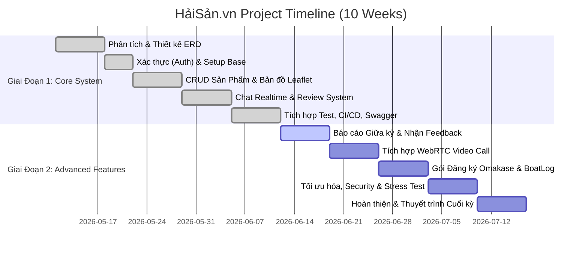

# Kế Hoạch Báo Cáo Tiến Độ Giữa Kỳ (Tuần 5 - Tuần 6) — HảiSản.vn

Tài liệu này lập kế hoạch chi tiết cho báo cáo tiến độ giữa kỳ (Milestone 1 - Midterm Progress Report) của dự án **HảiSản.vn (shop_sea)**, môn học **SWP391** (SU26, Lớp SE20A04, Nhóm 6). 

---

## 📅 Lịch Trình Phát Triển 10 Tuần Tổng Thể

---

## 📊 Báo Cáo Tiến Độ Hiện Tại (Hoàn Thành Tuần 1 - 5)

Dưới đây là nội dung chi tiết về các công việc nhóm đã hoàn thành trong nửa đầu dự án, sẵn sàng để báo cáo với giáo viên hướng dẫn:

### 1. Kiến Trúc & Công Nghệ (Tech Stack)
* **Backend:** Node.js + TypeScript (Express) mang lại sự an toàn kiểu dữ liệu (type-safe) và hiệu năng cao.
* **Database & Caching:** MongoDB (Mongoose ODM) kết hợp Redis Cache để quản lý phiên và tối ưu tốc độ truy vấn.
* **Frontend:** React (Vite) + Tailwind CSS tối ưu hóa giao diện người dùng và hiệu năng tải trang.
* **Kênh Realtime & Media:** Socket.io (cho chat thời gian thực và tín hiệu WebRTC).
* **Bảo mật:** JWT Stateless Auth kết hợp Redis Token Blacklist, Double Submit Cookie CSRF, Helmet, Rate Limiter chống spam.

### 2. Các Tính Năng Đã Hoàn Thành (Tính Đến Tuần 5)

| Tính Năng / Module | Trạng Thái | Mô Tả Kỹ Thuật |
| :--- | :---: | :--- |
| **Authentication & Auth Flow** | ✅ 100% | Đăng ký, đăng nhập JWT, gửi OTP qua SMS Gateway (ESMS) lưu Redis TTL 5p. Tích hợp Google OAuth. |
| **Quản Lý Sản Phẩm (Product CRUD)** | ✅ 100% | Thêm, sửa, xóa, tìm kiếm tin đăng hải sản. Phân biệt hải sản tươi sống (Fresh - có GPS) và hải sản khô (Dried - có hạn sử dụng). |
| **Tìm Kiếm Theo Bản Đồ (Leaflet.js)** | ✅ 100% | Sử dụng MongoDB `2dsphere` index và toán tử `$near` để tìm kiếm sản phẩm theo khoảng cách thực tế quanh vị trí GPS của người dùng. |
| **Hệ Thống Chat Realtime** | ✅ 100% | Nhắn tin 1-1 giữa Buyer và Seller qua Socket.io, lưu lịch sử trò chuyện trong MongoDB. |
| **Đánh Giá & Theo Dõi (Review/Follow)** | ✅ 100% | Người mua đánh giá chất lượng sản phẩm (rating sao + bình luận + ảnh thực tế), theo dõi ngư dân yêu thích. |
| **Admin Control Panel** | ✅ 100% | Thống kê số lượng bài đăng, quản lý danh sách tài khoản, duyệt tin đăng và xử lý báo cáo vi phạm. |
| **Kiểm Thử & Tự Động Hóa (CI/CD)** | ✅ 100% | Tích hợp bộ kiểm thử tự động Jest (16 test suites), tài liệu hóa API tương tác bằng Swagger UI (`/api-docs`), thiết lập GitHub Actions CI/CD Pipeline. |

---

## 🎯 Kế Hoạch 5 Tuần Tiếp Theo (Tuần 6 - 10)

Để hoàn thiện dự án đạt điểm tối đa từ hội đồng đánh giá, nhóm lập kế hoạch cho 5 tuần tiếp theo như sau:

### Tuần 6: Báo Cáo Giữa Kỳ & Tối Ưu Hóa Cổng Webhook
* **Mục tiêu:** Hoàn thành buổi báo cáo giữa kỳ trước giáo viên hướng dẫn, tiếp thu feedback.
* **Nội dung công việc:**
  * Chuẩn bị Slide báo cáo và kịch bản demo chạy thực tế.
  * Tối ưu hóa API Webhook tự động nâng cấp Premium qua Sepay Webhook (`POST /api/payment/webhook`), thực hiện cơ chế tự động logout cascade khi tài khoản chuyển đổi quyền hạn để làm mới token.

### Tuần 7: Tích Hợp Cuộc Gọi Video WebRTC (Real-time Video Calling)
* **Mục tiêu:** Hiện thực hóa tính năng "nhìn tận mắt hải sản ngoài khơi" qua cuộc gọi video ngang hàng (P2P).
* **Nội dung công việc:**
  * Triển khai WebRTC Signaling Server qua Socket.io để trao đổi SDP và ICE Candidates.
  * Xây dựng giao diện `VideoCallOverlay.jsx` phía React client hỗ trợ truyền phát video/audio.
  * Kiểm thử kết nối P2P sau NAT bằng STUN server miễn phí của Google.

### Tuần 8: Gói Đăng Ký Hải Sản Định Kỳ (Omakase Box) & Nhật Ký Cabin (Boat Logs)
* **Mục tiêu:** Bổ dung các tính năng nâng cao độc quyền phục vụ mô hình kinh doanh hải sản bền vững.
* **Nội dung công việc:**
  * **Omakase Box Subscription:** Cho phép người dùng đăng ký gói giao hải sản định kỳ hàng tuần/tháng theo các gói kích thước (Small, Medium, Large).
  * **Boat Logs (Nhật ký Cabin):** Cho phép ngư dân đăng hình ảnh và ghi chép hành trình kéo lưới ngoài khơi để người mua kiểm chứng xuất xứ.

### Tuần 9: Tích Hợp Hệ Thống, Bảo Mật & Đánh Giá Chất Lượng
* **Mục tiêu:** Đóng gói toàn bộ hệ thống, tối ưu hóa bảo mật và kiểm tra tải.
* **Nội dung công việc:**
  * Kiểm tra và vá các lỗ hổng bảo mật: Rate Limiting cho chat socket, kiểm tra lại chống NoSQL Injection.
  * Chạy test phủ mã nguồn (Unit test coverage > 85%) và đảm bảo GitHub Actions hoàn thành không lỗi.
  * Tối ưu hiệu năng truy vấn DB bằng các Compound Indexes.

### Tuần 10: Nghiệm Thu & Thuyết Trình Cuối Kỳ
* **Mục tiêu:** Đóng băng mã nguồn, chuẩn bị tài liệu bàn giao và slide thuyết trình chung cuộc.
* **Nội dung công việc:**
  * Đóng gói Docker Compose hoàn chỉnh chạy đa container (Client, Server, MongoDB, Redis).
  * Quay video demo toàn bộ luồng nghiệp vụ thực tế.
  * Chuẩn bị tài liệu kỹ thuật cuối kỳ bàn giao cho giáo viên.

---

## 🎤 Kịch Bản Trình Bày Giữa Kỳ (Slide & Demo Agenda)

Để buổi báo cáo tiến độ giữa kỳ thuyết phục giáo viên nhất, nhóm sẽ trình bày theo cấu trúc sau:

### 1. Phân Chia Cấu Trúc Slide (10 - 12 Phút)
1. **Slide 1: Giới thiệu dự án & Thành viên:** Tên đề tài HảiSản.vn - Hệ thống chợ hải sản bản địa kết nối thời gian thực theo định vị.
2. **Slide 2: Vấn đề & Giải pháp:** Khó khăn của ngư dân (bị thương lái ép giá, người mua không kiểm chứng được độ tươi ngon) $\rightarrow$ Giải pháp kết nối trực tiếp, định vị GPS gần nhất và gọi video WebRTC trực tuyến.
3. **Slide 3: Kiến trúc hệ thống:** Mô tả mô hình 3-Tier, sơ đồ WebRTC Signaling qua Socket.io và cơ chế bảo mật JWT + Redis.
4. **Slide 4: Sơ đồ ERD (Database Design):** Giải thích 11 collections của MongoDB, các liên kết logic và hệ thống chỉ mục (GPS index, Text index).
5. **Slide 5: Tiến độ thực tế (Những gì đã chạy được):** Liệt kê các chức năng đã làm, đính kèm kết quả chạy CI/CD thành công trên GitHub.
6. **Slide 6: Kế hoạch Phase tiếp theo:** Kế hoạch chi tiết từ tuần 6 đến tuần 10.

### 2. Kịch Bản Demo Trực Quan (5 - 7 Phút)
* **Bước 1: Trải nghiệm người dùng chưa đăng nhập:**
  * Mở trang chủ, hệ thống tự động định vị GPS của người dùng và hiển thị danh sách ngư dân & hải sản xung quanh trên bản đồ Leaflet.
  * Tìm kiếm hải sản bằng Full-Text Search (ví dụ gõ "Cá thu").
* **Bước 2: Luồng Xác Thực (Authentication):**
  * Tạo tài khoản người bán mới $\rightarrow$ Nhận OTP (giả lập hoặc SMS thật) $\rightarrow$ Đăng nhập.
* **Bước 3: Người Bán đăng tải sản phẩm:**
  * Người bán đăng bài bán "Tôm hùm xanh" kèm ảnh, nhập tọa độ GPS cập cảng, số ký.
* **Bước 4: Người Mua tương tác:**
  * Đăng nhập tài khoản người mua $\rightarrow$ Vào trang chi tiết tôm hùm $\rightarrow$ Chat realtime thương lượng với người bán (mở song song hai màn hình để thấy tin nhắn nhảy realtime).
* **Bước 5: Trang Admin:**
  * Đăng nhập quyền Admin $\rightarrow$ Xem dashboard thống kê biểu đồ hoạt động của chợ $\rightarrow$ Kiểm duyệt tin đăng.
* **Bước 6: Minh chứng kỹ thuật:**
  * Mở Swagger UI (`/api-docs`) để chứng minh hệ thống API được đặc tả chuẩn chỉ.
  * Chạy lệnh chạy test `npm run test` trực tiếp để chứng minh hệ thống có Unit Tests bảo vệ mã nguồn.

---

## 🤖 Báo Cáo Sử Dụng AI (AI Audit Log Summary)

Giáo viên đặc biệt chú trọng tính trung thực và khả năng kiểm soát mã nguồn khi dùng AI. Nhóm sẽ chủ động trình bày cách quản lý AI qua tài liệu **AI Audit Log**:
* **Minh bạch công nghệ:** Toàn bộ lịch sử dùng AI được lưu tại [AI_AUDIT_LOG.md](file:///c:/Users/PC/OneDrive/Desktop/sea_shop/sea_shop/swp391-su26-ai-audit-project-swp391_se20a04_group-06/docs/AI_AUDIT_LOG.md) (Claude Sonnet: 6 lần, Copilot: 1 lần, ChatGPT: 1 lần).
* **Quy trình áp dụng:** Sử dụng AI để sinh boilerplate code (Auth middleware, database schema base, Socket.io event loop).
* **Đóng góp của con người (Human-in-the-loop):**
  * Tự gỡ lỗi Leaflet map icon lỗi 404 trên Vite (AI không biết lỗi này).
  * Tự tối ưu các truy vấn địa lý địa phương.
  * Viết logic xử lý thanh toán Sepay Webhook bảo mật.
  * Sửa các kiểu dữ liệu nâng cao Mongoose Types.ObjectId để code không bị lỗi compile TypeScript.
