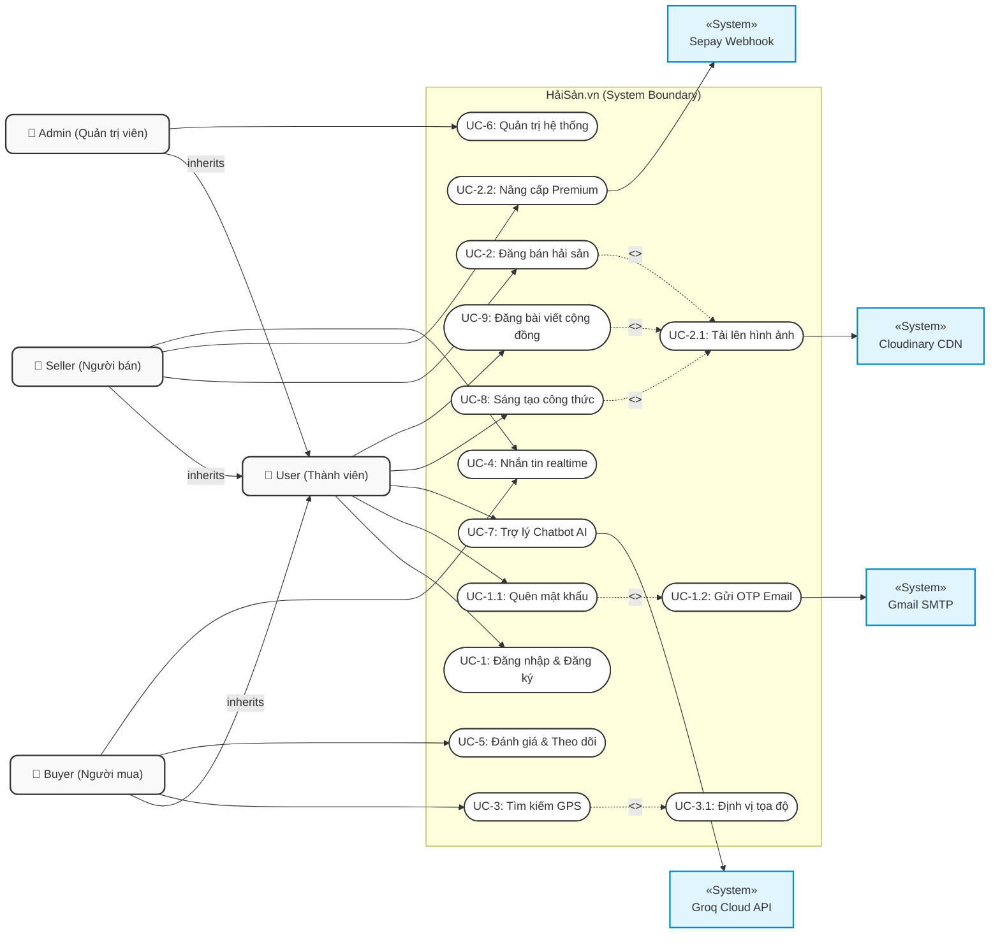
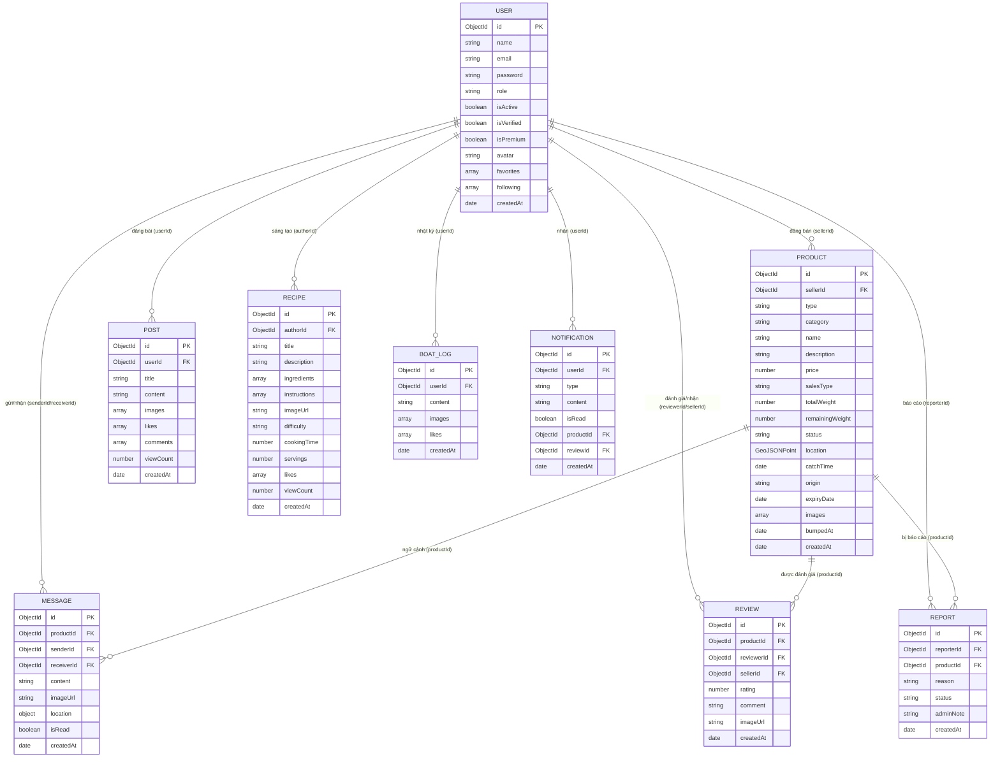

# Kế Hoạch Báo Cáo Tiến Độ Giữa Kỳ (Tuần 5 - Tuần 6) — HảiSản.vn

Tài liệu này lập kế hoạch chi tiết cho báo cáo tiến độ giữa kỳ (Milestone 1 - Midterm Progress Report) của dự án **HảiSản.vn (shop_sea)**, môn học **SWP391** (SU26, Lớp SE20A04, Nhóm 6).

---

## 📅 Lịch Trình Phát Triển 10 Tuần Tổng Thể

| Tuần | Nội dung công việc | Kết quả đạt được | Trạng thái |
| :---: | :--- | :--- | :---: |
| **Tuần 1 - 2** | Khởi tạo dự án, phân tích yêu cầu, thiết kế kiến trúc hệ thống và cơ sở dữ liệu (ERD). | Kịch bản kiến trúc, sơ đồ thực tế (11 collections). | ✅ Hoàn thành |
| **Tuần 3** | Hiện thực hóa quy trình Xác thực (Auth) bảo mật, băm mật khẩu, phân quyền JWT, và CRUD Sản phẩm cơ bản. | API đăng ký/đăng nhập, API CRUD sản phẩm, kết nối cơ sở dữ liệu MongoDB/Mongoose. | ✅ Hoàn thành |
| **Tuần 4** | Tích hợp bản đồ định vị Leaflet (GPS), Haversine filter, Chat realtime qua Socket.io và hệ thống Đánh giá/Theo dõi. | Giao diện bản đồ, nhắn tin thời gian thực 1-1, đánh giá ngư dân. | ✅ Hoàn thành |
| **Tuần 5** | Triển khai Unit Tests, Swagger API documentation, và thiết lập CI/CD tự động trên GitHub Actions. | 16 test suites (Jest) đạt độ bao phủ tốt, endpoint `/api-docs` hoạt động, CI chạy không lỗi. | ✅ Hoàn thành |
| **Tuần 6** | **(Hiện tại)** Báo cáo tiến độ giữa kỳ, nhận phản hồi từ giáo viên và tối ưu hóa Sepay Webhook nâng cấp Premium. | Slide thuyết trình giữa kỳ, luồng Webhook hoàn thiện. | 🔄 Đang chạy |
| **Tuần 7** | Triển khai cuộc gọi video trực tuyến thời gian thực (WebRTC Video Calling). | Kết nối ngang hàng P2P Buyer - Seller, giao diện Video call overlay. | 📋 Kế hoạch |
| **Tuần 8** | Xây dựng tính năng Nhật ký cabin (Boat Logs) và Điều chỉnh giao diện Web theo phản hồi. | Nhật ký cabin chạy được, giao diện Web được tối ưu hoá và responsive tốt hơn. | 📋 Kế hoạch |
| **Tuần 9** | Tối ưu hóa hiệu năng truy vấn dữ liệu (Compound Indexes), rà soát bảo mật nâng cao (Spam rate limit, CSRF). | Hệ thống chịu tải tốt, vá toàn bộ lỗ hổng bảo mật. | 📋 Kế hoạch |
| **Tuần 10** | Đóng gói hệ thống bằng Docker Compose, quay video demo toàn bộ luồng nghiệp vụ và bảo vệ dự án cuối kỳ. | File `docker-compose.yml` hoàn chỉnh, tài liệu bàn giao. | 📋 Kế hoạch |

---

## 📊 Báo Cáo Tiến Độ Hiện Tại (Hoàn Thành Tuần 1 - 5)

### 1. Kiến Trúc & Công Nghệ (Tech Stack)
* **Backend:** Node.js + TypeScript (Express) mang lại sự an toàn kiểu dữ liệu (type-safe) và khả năng mở rộng.
* **Database & Caching:** MongoDB (Mongoose ODM) kết hợp Redis Cache để quản lý phiên, lưu mã xác minh OTP (khi đặt lại mật khẩu) và lưu token blacklist.
* **Frontend:** React (Vite) + Bootstrap (v5.3.8) cho layout responsive & Grid, kết hợp inline style cho giao diện trực quan.
* **Kênh Realtime & Media:** Socket.io (cho chat thời gian thực và tín hiệu WebRTC).
* **Bảo mật:** JWT Stateless Auth kết hợp Redis Token Blacklist, Double Submit Cookie CSRF, Helmet, Rate Limiter chống spam.

### 2. Các Tính Năng Đã Hoàn Thành (Tính Đến Tuần 5)

| Tính Năng / Module | Trạng Thái | Mô Tả Kỹ Thuật |
| :--- | :---: | :--- |
| **Authentication & Auth Flow** | ✅ 100% | Đăng ký/Đăng nhập JWT bằng Email/Password, tích hợp Google OAuth. Gửi OTP qua Email (Gmail SMTP) lưu Redis TTL 5p để phục vụ chức năng quên mật khẩu. |
| **Quản Lý Sản Phẩm (Product CRUD)** | ✅ 100% | Thêm, sửa, xóa, tìm kiếm tin đăng hải sản. Phân biệt hải sản tươi sống (Fresh - có GPS) và hải sản khô (Dried - có hạn sử dụng). |
| **Tìm Kiếm Theo Bản Đồ (Leaflet.js)** | ✅ 100% | Sử dụng MongoDB `2dsphere` index và toán tử `$near` để tìm kiếm sản phẩm theo khoảng cách thực tế quanh vị trí GPS của người dùng. |
| **Hệ Thống Chat Realtime** | ✅ 100% | Nhắn tin 1-1 giữa Buyer và Seller qua Socket.io, lưu lịch sử trò chuyện trong MongoDB. |
| **Đánh Giá & Theo Dõi (Review/Follow)** | ✅ 100% | Người mua đánh giá chất lượng sản phẩm (rating sao + bình luận + ảnh thực tế), theo dõi ngư dân yêu thích. |
| **Admin Control Panel** | ✅ 100% | Thống kê số lượng bài đăng, quản lý danh sách tài khoản, duyệt tin đăng và xử lý báo cáo vi phạm. |
| **Diễn Đàn Cộng Đồng (Community)** | ✅ 100% | Đăng bài viết cộng đồng chia sẻ kinh nghiệm biển cả, thích (like), bình luận (comment) realtime và tải lên hình ảnh qua Cloudinary. |
| **Cẩm Nang Công Thức (Recipes)** | ✅ 100% | Đăng tải công thức nấu món ăn hải sản, hướng dẫn chi tiết các bước, phân loại độ khó, thời gian nấu và định lượng khẩu phần. |
| **Trợ Lý Chatbot AI (AI Assistant)** | ✅ 100% | Tích hợp mô hình LLM Llama 3.1 qua Groq Cloud API làm "Trợ lý hải sản" tư vấn cách chọn/chế biến hải sản và hướng dẫn tính năng web. |
| **Kiểm Thử & Tự Động Hóa (CI/CD)** | ✅ 100% | Tích hợp bộ kiểm thử tự động Jest (16 test suites), tài liệu hóa API tương tác bằng Swagger UI (`/api-docs`), thiết lập GitHub Actions CI/CD Pipeline. |

---

## 📐 Sơ Đồ Use Case Hệ Thống (UML Use Case Diagram)

Dưới đây là sơ đồ Use Case tổng thể đại diện cho các tác vụ của các Actor chính đối với các chức năng đã hoàn thành tính đến Tuần 5, được thiết kế theo đúng chuẩn UML với quan hệ kế thừa (generalization), bao gồm (include) và mở rộng (extend).



---

## 🗄️ Sơ Đồ Cơ Sở Dữ Liệu Thực Thể (Database ERD Diagram)

Dưới đây là sơ đồ quan hệ thực thể (ERD) chi tiết mô tả 10 collections chính của MongoDB trong hệ thống, chỉ rõ các kiểu dữ liệu và mối quan hệ ràng buộc khoá ngoại (Foreign Key) giữa các collection:



### 📝 Giải Thích Chi Tiết Sơ Đồ Quan Hệ Thực Thể (ERD Specifications)

Sơ đồ ERD trên phản ánh thiết kế cơ sở dữ liệu hướng tài liệu (Document-oriented) của MongoDB nhưng vẫn duy trì các liên kết logic chặt chẽ để phục vụ các luồng nghiệp vụ phức tạp:

1. **Thực thể Trung tâm & Phân quyền (`USER`):**
   * Đóng vai trò là Actor trong hệ thống. Dựa vào trường `role` để phân quyền (`User` hoặc `Admin`).
   * Các cờ trạng thái `isVerified` (ngư dân uy tín) và `isPremium` (tài khoản ngư dân trả phí qua cổng Sepay) quyết định quyền lợi hiển thị tin đăng.
   * Liên kết tự tham chiếu (Self-referencing): Mảng `favorites` (lưu danh sách các `PRODUCT` yêu thích) và mảng `following` (lưu ID các `USER` là ngư dân mà người này đang theo dõi).

2. **Quản lý Hàng hóa & Không gian (`PRODUCT`):**
   * Mỗi sản phẩm được đăng bán bởi duy nhất một ngư dân (`sellerId` liên kết đến `USER` với quan hệ 1-N).
   * Chứa trường `location` định dạng **GeoJSON Point** được đánh chỉ mục `2dsphere` để phục vụ truy vấn khoảng cách GPS theo thời gian thực (Tìm quanh đây).

3. **Giao tiếp Realtime (`MESSAGE` & `NOTIFICATION`):**
   * `MESSAGE` lưu trữ các hội thoại thương lượng. Nó liên kết với `PRODUCT` (`productId`) để lưu ngữ cảnh cuộc chat (Chat về sản phẩm nào) và kết nối `senderId`, `receiverId` về `USER`.
   * `NOTIFICATION` lưu các thông báo đẩy realtime cho người dùng (`userId`), chứa liên kết động tùy chọn tới `productId` hoặc `reviewId` để khi click vào thông báo sẽ chuyển hướng đúng trang.

4. **Tương tác Cộng đồng & Uy tín (`REVIEW`, `POST`, `RECIPE`, `BOAT_LOG`):**
   * `REVIEW` thể hiện đánh giá của người mua (`reviewerId`) dành cho sản phẩm (`productId`) và gián tiếp cho người bán (`sellerId`), giúp hệ thống tự động tính toán lại điểm rating trung bình cho ngư dân.
   * `POST` (bài viết cộng đồng), `RECIPE` (công thức chế biến), và `BOAT_LOG` (nhật ký cabin hành trình đi biển của ngư dân) giúp kết nối cộng đồng. Tất cả đều liên kết trực tiếp với tác giả viết bài (`userId`/`authorId`).

5. **Giám sát và Hỗ trợ (`REPORT`):**
   * Lưu trữ các khiếu nại của người dùng (`reporterId`) về một sản phẩm vi phạm (`productId`) gửi đến Admin để phê duyệt hoặc gỡ bỏ tin đăng.

---

## 🧪 Hệ Thống Kiểm Thử Tự Động (Automated Testing Suite)

Để đảm bảo chất lượng phần mềm lớp doanh nghiệp và hạn chế tối đa lỗi hồi quy (regression bugs) khi phát triển các tính năng nâng cao ở giai đoạn sau, hệ thống backend được bao bọc bởi bộ kiểm thử tự động toàn diện sử dụng **Jest** và **ts-jest** (dành cho TypeScript):

### 1. Danh Sách Các Test Suites Đã Viết (16 Test Files)

| STT | File Test | Thành Phần Kiểm Thử | Nội Dung Chi Tiết |
| :---: | :--- | :--- | :--- |
| 1 | `auth.service.test.ts` | Xác thực (Auth Service) | Test logic đăng ký, đăng nhập, cấp JWT, so khớp mật khẩu băm Bcrypt. |
| 2 | `otp.service.test.ts` | Xác minh OTP (OTP Service) | Test logic tạo mã OTP ngẫu nhiên, lưu trữ Redis Cache, gửi OTP và xác thực khớp token. |
| 3 | `product.service.test.ts` | Sản phẩm (Product Service) | Test các nghiệp vụ CRUD, validate dữ liệu đầu vào và logic cooldown đẩy bài. |
| 4 | `review.service.test.ts` | Đánh giá (Review Service) | Test tính điểm đánh giá trung bình sao của ngư dân khi có review mới được gửi lên. |
| 5 | `user.service.test.ts` | Người dùng (User Service) | Test các hàm cập nhật thông tin cá nhân và đặc biệt là logic xóa tài khoản cascade GDPR nâng cao. |
| 6 | `message.service.test.ts` | Chat (Message Service) | Test luồng lưu tin nhắn chat, gửi ảnh, vị trí và cập nhật trạng thái đã đọc (`isRead`). |
| 7 | `follow.service.test.ts` | Theo dõi (Follow Service) | Test logic người mua bấm theo dõi/hủy theo dõi ngư dân và đồng bộ số liệu followers. |
| 8 | `favorite.service.test.ts`| Yêu thích (Favorite Service)| Test chức năng lưu sản phẩm vào danh sách yêu thích và kiểm tra tồn tại. |
| 9 | `boatLog.service.test.ts` | Nhật ký (BoatLog Service) | Test nghiệp vụ đăng và quản lý nhật ký cabin hành trình của ngư dân. |
| 10 | `recipe.service.test.ts` | Công thức (Recipe Service) | Test CRUD công thức nấu món ăn hải sản và quản lý lượt xem. |
| 11 | `post.service.test.ts` | Bài viết (Post Service) | Test CRUD bài viết cộng đồng, tính năng thích (like) và bình luận (comment). |
| 12 | `report.service.test.ts` | Báo cáo (Report Service) | Test logic người dùng gửi báo cáo vi phạm sản phẩm lên hệ thống. |
| 13 | `admin.service.test.ts` | Quản trị (Admin Service) | Test các quyền hạn Admin: xóa tin vi phạm, khóa tài khoản, duyệt tin đăng. |
| 14 | `badge.service.test.ts` | Danh hiệu (Badge Service) | Test hệ thống tự động cấp danh hiệu (uy tín, tích cực) cho tài khoản ngư dân. |
| 15 | `haversine.test.ts` | Thuật toán khoảng cách | Test thuật toán Haversine tính toán khoảng cách thực tế mặt cầu giữa 2 tọa độ GPS. |
| 16 | `follow.controller.test.ts`| Điều hướng API Follow | Test tích hợp (Integration Test) luồng API endpoint của tính năng theo dõi. |

### 2. Các Lệnh Thực Thi Kiểm Thử

* **Chạy toàn bộ các test suites:**
  ```bash
  cd backend
  npm run test
  ```
* **Chạy test và xuất báo cáo độ bao phủ mã nguồn (Coverage Report):**
  ```bash
  cd backend
  npm run test:cov
  ```
  *Báo cáo kết quả kiểm thử dạng HTML trực quan sẽ được xuất ra thư mục `backend/coverage/lcov-report/index.html`. Cho phép xem trực quan tỷ lệ bao phủ của từng file code nghiệp vụ.*

---

## 📝 Đặc Tả Và Luồng Xử Lý Chi Tiết Của Các Use Case Đã Hoàn Thành

Dưới đây là đặc tả chi tiết cho 6 Use Case cốt lõi đã được xây dựng và hoàn thành trong giai đoạn 1 (Tuần 1 - 5).

### UC-1: Đăng Ký & Đăng Nhập Hệ Thống

| Trường Thông Tin | Nội Dung Đặc Tả |
| :--- | :--- |
| **Tên Use Case** | UC-1: Đăng ký & Đăng nhập hệ thống |
| **Tác Nhân (Actors)** | Người Mua (Buyer), Người Bán (Seller) |
| **Mô Tả** | Người dùng đăng ký tài khoản mới qua Email và Mật khẩu, hoặc đăng nhập trực tiếp qua Email/Password hoặc Google OAuth để nhận mã JWT truy cập tài nguyên. Hỗ trợ đặt lại mật khẩu thông qua mã OTP gửi qua Email. |
| **Tiền Điều Kiện** | Người dùng có thiết bị kết nối mạng Internet. |
| **Luồng Sự Kiện Chính** | **Nhánh 1: Đăng ký tài khoản**<br>1. Người dùng chọn mục "Đăng ký" trên giao diện.<br>2. Hệ thống hiển thị biểu mẫu yêu cầu nhập Họ tên, Email, Mật khẩu.<br>3. Người dùng nhập thông tin và nhấn "Xác nhận".<br>4. Hệ thống validate thông tin, băm mật khẩu bằng Bcrypt, lưu tài khoản mới vào MongoDB và tự động đăng nhập (trả về JWT).<br><br>**Nhánh 2: Đăng nhập**<br>1. Người dùng nhập Email, Mật khẩu hoặc nhấn chọn "Đăng nhập bằng Google".<br>2. Hệ thống xác thực thông tin đăng nhập (hoặc verify Google ID token).<br>3. Trả về Access Token (maxAge 15 phút) và Refresh Token (lưu vào Redis Cache 7 ngày).<br>4. Giao diện lưu cookie bảo mật và chuyển hướng người dùng vào Dashboard.<br><br>**Nhánh 3: Quên mật khẩu (Forgot Password)**<br>1. Người dùng chọn "Quên mật khẩu" và nhập Email.<br>2. Hệ thống kiểm tra Email tồn tại, tạo mã OTP 6 số qua module `crypto` lưu vào Redis (TTL 5 phút) và gửi email OTP qua Gmail SMTP.<br>3. Người dùng nhập OTP $\rightarrow$ Hệ thống verify và tạo một Reset Token ngắn hạn lưu trong Redis.<br>4. Người dùng nhập mật khẩu mới kèm Reset Token $\rightarrow$ Hệ thống cập nhật mật khẩu băm mới vào MongoDB và xóa Reset Token. |
| **Luồng Thay Thế** | * **Trùng Email khi đăng ký:** Hệ thống báo lỗi "Email đã được sử dụng" và yêu cầu nhập email khác.<br>* **Sai Email/Mật khẩu khi Đăng nhập:** Hệ thống báo lỗi "Tài khoản hoặc mật khẩu không chính xác", khóa tài khoản tạm thời nếu nhập sai liên tiếp quá 20 lần / 15 phút (Rate Limiting).<br>* **Nhập sai OTP quên mật khẩu:** Hệ thống báo lỗi "Mã OTP không hợp lệ hoặc đã hết hạn". |
| **Hậu Điều Kiện** | Tài khoản người dùng được xác thực và lưu trữ trong MongoDB. Phiên làm việc được thiết lập. |

---

### UC-2: Đăng Bán Hải Sản

| Trường Thông Tin | Nội Dung Đặc Tả |
| :--- | :--- |
| **Tên Use Case** | UC-2: Đăng bán hải sản |
| **Tác Nhân (Actors)** | Người Bán (Seller / Ngư dân) |
| **Mô Tả** | Người bán tạo tin đăng bán sản phẩm hải sản lên hệ thống chợ, cung cấp đầy đủ thông tin, hình ảnh, phân loại và định vị địa lý (GPS) cập cảng. |
| **Tiền Điều Kiện** | Người bán đã đăng nhập thành công vào hệ thống. |
| **Luồng Sự Kiện Chính** | 1. Người bán nhấn nút "Đăng tin mới" tại trang quản lý.<br>2. Hệ thống hiển thị biểu mẫu đăng sản phẩm.<br>3. Người bán nhập: Tên sản phẩm, giá, loại (Tươi sống / Hải sản khô), mô tả, trọng lượng.<br>4. Người bán chọn vị trí cập cảng trên bản đồ Leaflet hoặc hệ thống tự động nhận diện GPS trình duyệt để điền vào trường Location.<br>5. Người bán kéo thả tối đa 5 hình ảnh sản phẩm.<br>6. Hệ thống nhận tệp ảnh ở dạng buffer qua `multer`, stream trực tiếp lên Cloudinary CDN để lấy URL ảnh.<br>7. Hệ thống validate dữ liệu qua middleware validation và lưu sản phẩm vào MongoDB với GeoJSON Point định vị.<br>8. Tin đăng được tạo thành công và hiển thị công khai trên chợ. |
| **Luồng Thay Thế** | * **Thiếu thông tin bắt buộc:** Hệ thống hiển thị lỗi cảnh báo đỏ cạnh các trường còn thiếu (ví dụ: thiếu thời gian đánh bắt đối với sản phẩm tươi).<br>* **Lỗi upload ảnh:** Nếu Cloudinary không phản hồi, hệ thống trả về lỗi 500 và yêu cầu người bán thử lại. |
| **Hậu Điều Kiện** | Sản phẩm mới được lưu vào collection `products` kèm GPS index `2dsphere` để hỗ trợ tìm kiếm khoảng cách. |

---

### UC-3: Tìm Kiếm Theo Định Vị GPS (Bản Đồ Leaflet)

| Trường Thông Tin | Nội Dung Đặc Tả |
| :--- | :--- |
| **Tên Use Case** | UC-3: Tìm kiếm hải sản theo vị trí địa lý |
| **Tác Nhân (Actors)** | Người Mua (Buyer) |
| **Mô Tả** | Người mua quét tìm kiếm các sản phẩm hải sản xung quanh vị trí hiện tại của mình trực quan qua bản đồ số Leaflet. |
| **Tiền Điều Kiện** | Người mua đã cấp quyền truy cập GPS cho trình duyệt web. |
| **Luồng Sự Kiện Chính** | 1. Người mua nhấn chọn tab "Bản đồ khám phá" hoặc "Tìm quanh đây".<br>2. Giao diện kích hoạt HTML5 Geolocation API để lấy tọa độ [Kinh độ, Vĩ độ] hiện tại của người mua.<br>3. Bản đồ Leaflet.js hiển thị vị trí của Người mua làm tâm điểm.<br>4. Hệ thống tự động gửi yêu cầu GET về backend kèm tọa độ hiện tại và bán kính lọc (ví dụ: 10km).<br>5. Backend thực hiện truy vấn MongoDB bằng toán tử `$near` sử dụng GeoJSON Point và index `2dsphere`.<br>6. Backend trả về danh sách các sản phẩm và ngư dân nằm trong bán kính lọc cùng khoảng cách tương ứng.<br>7. Bản đồ hiển thị các Marker sản phẩm gần đó, click vào Marker sẽ hiện popup chi tiết sản phẩm. |
| **Luồng Thay Thế** | * **Người dùng từ chối cấp quyền GPS:** Hệ thống hiển thị thông báo yêu cầu bật định vị, đồng thời fallback (chuyển sang) lấy vị trí mặc định tại trung tâm TP. Đà Nẵng hoặc cho phép nhập vị trí thủ công. |
| **Hậu Điều Kiện** | Người mua nhìn thấy danh sách trực quan các bài đăng bán hải sản xếp theo thứ tự khoảng cách từ gần nhất đến xa nhất. |

---

### UC-4: Nhắn Tin Realtime (Real-time Chat)

| Trường Thông Tin | Nội Dung Đặc Tả |
| :--- | :--- |
| **Tên Use Case** | UC-4: Nhắn tin thời gian thực |
| **Tác Nhân (Actors)** | Người Mua (Buyer), Người Bán (Seller) |
| **Mô Tả** | Người mua và người bán nhắn tin thương lượng trực tiếp về giá cả, thời gian giao nhận hải sản trên trang chi tiết sản phẩm. |
| **Tiền Điều Kiện** | Cả hai người dùng đều đã đăng nhập vào hệ thống. |
| **Luồng Sự Kiện Chính** | 1. Người mua click nút "Chat với ngư dân" tại trang chi tiết sản phẩm.<br>2. Hệ thống khởi tạo phòng chat (Room) riêng biệt thông qua Socket.IO dựa trên `conversationId` kết hợp giữa BuyerID, SellerID và ProductID.<br>3. Người mua nhập nội dung tin nhắn và nhấn gửi.<br>4. Socket.io Client phát sự kiện `sendMessage` kèm nội dung lên Socket.io Server.<br>5. Server nhận dữ liệu, ghi bản ghi vào collection `messages` trong MongoDB và đồng thời phát sự kiện `receiveMessage` tới SocketID của người bán đang online trong phòng chat.<br>6. Màn hình người bán hiển thị tin nhắn ngay lập tức mà không cần tải lại trang.<br>7. Hệ thống tự động gửi thông báo hệ thống (Notification) nếu đối phương đang offline. |
| **Luồng Thay Thế** | * **Mất kết nối mạng đột ngột:** Socket.io kích hoạt cơ chế tự động kết nối lại (Auto-reconnect). Tin nhắn gửi đi thất bại được đánh dấu màu đỏ kèm nút "Gửi lại". |
| **Hậu Điều Kiện** | Cuộc trò chuyện được lưu trữ và hiển thị realtime giữa hai trình duyệt. |

---

### UC-5: Đánh Giá & Theo Dõi Ngư Dân

| Trường Thông Tin | Nội Dung Đặc Tả |
| :--- | :--- |
| **Tên Use Case** | UC-5: Đánh giá & Theo dõi ngư dân |
| **Tác Nhân (Actors)** | Người Mua (Buyer) |
| **Mô Tả** | Người mua đánh giá chất lượng sản phẩm của ngư dân (bằng sao từ 1-5 kèm bình luận) và nhấn theo dõi để nhận thông báo khi ngư dân có bài đăng mới. |
| **Tiền Điều Kiện** | Người mua đã đăng nhập vào hệ thống. |
| **Luồng Sự Kiện Chính** | **Nhánh Đánh giá:**<br>1. Người mua vào trang chi tiết sản phẩm đã mua.<br>2. Chọn biểu tượng sao (1-5 sao) và viết nhận xét thực tế.<br>3. Hệ thống validate và lưu đánh giá vào collection `reviews` trong database.<br>4. Hệ thống chạy tiến trình bất đồng bộ tính lại điểm trung bình sao của Ngư dân.<br>**Nhánh Theo dõi:**<br>1. Người mua vào trang cá nhân của ngư dân (Seller Profile Page).<br>2. Nhấn nút "Theo dõi ngư dân".<br>3. Hệ thống thêm ID ngư dân vào mảng `following` trong tài khoản người mua và tăng số lượng `followersCount` của ngư dân. |
| **Luồng Thay Thế** | * **Đánh giá trùng lặp:** Hệ thống kiểm tra nếu người dùng đã đánh giá sản phẩm này trước đó sẽ chặn lại và gợi ý "Bạn chỉ có thể chỉnh sửa đánh giá cũ". |
| **Hậu Điều Kiện** | Điểm trung bình uy tín của ngư dân được cập nhật. Ngư dân có thêm một người theo dõi. |

---

### UC-6: Quản Trị Hệ Thống (Admin Control Panel)

| Trường Thông Tin | Nội Dung Đặc Tả |
| :--- | :--- |
| **Tên Use Case** | UC-6: Quản trị hệ thống |
| **Tác Nhân (Actors)** | Quản Trị Viên (Admin) |
| **Mô Tả** | Admin theo dõi tổng thể sức khỏe của chợ thông qua dashboard thống kê, duyệt các tin đăng bán sản phẩm và xử lý các báo cáo vi phạm từ người dùng. |
| **Tiền Điều Kiện** | Tài khoản đăng nhập có vai trò `role: "Admin"`. |
| **Luồng Sự Kiện Chính** | 1. Admin truy cập đường dẫn dành riêng `/admin`. Giao diện kiểm tra Route Guard bằng cookie chứa JWT.<br>2. Hệ thống gọi các API tổng hợp dữ liệu thống kê từ database.<br>3. Màn hình Dashboard hiển thị biểu đồ số lượng đăng ký mới, số bài đăng mới trong tuần.<br>4. Admin vào danh sách "Kiểm duyệt sản phẩm" để xem các tin đăng chờ duyệt.<br>5. Admin nhấn "Phê duyệt" để tin hiển thị công khai hoặc "Xóa" kèm lý do nếu vi phạm tiêu chuẩn.<br>6. Admin vào danh sách "Báo cáo vi phạm" (Reports), tiến hành kiểm tra nội dung bị báo cáo, cập nhật trạng thái xử lý (`Resolved` / `Dismissed`). |
| **Luồng Thay Thế** | * **Tài khoản không đủ thẩm quyền truy cập:** Hệ thống tự động chặn lại từ Route Guard của React Router và chuyển hướng (redirect) về trang chủ kèm cảnh báo Toast "Không có quyền truy cập". |
| **Hậu Điều Kiện** | Các tin đăng không hợp lệ bị xóa, cơ sở dữ liệu được làm sạch, tài khoản vi phạm bị khóa tạm thời. |

---

### UC-7: Trợ Lý Chatbot AI

| Trường Thông Tin | Nội Dung Đặc Tả |
| :--- | :--- |
| **Tên Use Case** | UC-7: Trợ lý Chatbot AI |
| **Tác Nhân (Actors)** | Người Mua (Buyer), Người Bán (Seller) |
| **Mô Tả** | Người dùng chat trực tiếp với Trợ lý AI trên giao diện để nhờ tư vấn cách lựa chọn, bảo quản hải sản, gợi ý món ăn ngon, hoặc hướng dẫn sử dụng các chức năng của website HảiSản.vn. |
| **Tiền Điều Kiện** | Hệ thống đã khởi chạy và cấu hình kết nối Groq API Key. |
| **Luồng Sự Kiện Chính** | 1. Người dùng click vào biểu tượng bong bóng Chatbot AI trên màn hình.<br>2. Hệ thống mở cửa sổ hội thoại chat.<br>3. Người dùng nhập câu hỏi (ví dụ: "làm sao để chọn cua biển ngon?") và nhấn gửi.<br>4. Backend nhận request kèm theo nội dung câu hỏi và mảng lịch sử trò chuyện (history) để hỗ trợ giữ ngữ cảnh hội thoại.<br>5. Backend gọi Groq Cloud API sử dụng model `llama-3.1-8b-instant` cùng system instruction định nghĩa sẵn vai trò "Trợ lý hải sản".<br>6. Hệ thống nhận câu trả lời từ LLM trong thời hạn tối đa 15 giây (timeout cooldown).<br>7. Trả câu trả lời về frontend và hiển thị sinh động lên màn hình chat cho người dùng. |
| **Luồng Thay Thế** | * **Chưa cấu hình API Key hoặc Groq API lỗi:** Hệ thống trả về thông báo lỗi "Hệ thống AI đang bảo trì" hoặc "Trợ lý AI tạm thời không khả dụng".<br>* **Lỗi quá tải / quá hạn thời gian (Timeout):** Trả về thông báo "AI đang bận, vui lòng thử lại sau" (cooldown 15s) hoặc "Hệ thống đang quá tải" (lỗi 429). |
| **Hậu Điều Kiện** | Cuộc trò chuyện diễn ra bình thường, người dùng nhận được tư vấn trực tiếp từ AI. |

---

### UC-8: Sáng Tạo Công Thức Nấu Ăn

| Trường Thông Tin | Nội Dung Đặc Tả |
| :--- | :--- |
| **Tên Use Case** | UC-8: Sáng tạo công thức nấu ăn |
| **Tác Nhân (Actors)** | Người Mua (Buyer), Người Bán (Seller) |
| **Mô Tả** | Người dùng đăng tải công thức nấu món ăn hải sản, hướng dẫn chi tiết các bước, phân loại độ khó, thời gian chế biến, định lượng khẩu phần và đính kèm hình ảnh minh họa qua Cloudinary. |
| **Tiền Điều Kiện** | Người dùng đã đăng nhập thành công vào hệ thống. |
| **Luồng Sự Kiện Chính** | 1. Người dùng chọn mục "Đăng công thức mới" trên giao diện.<br>2. Hệ thống hiển thị biểu mẫu điền thông tin công thức.<br>3. Người dùng nhập: Tiêu đề món ăn, mô tả, danh sách nguyên liệu, các bước thực hiện, độ khó (Easy / Medium / Hard), thời gian nấu (phút), định lượng servings.<br>4. Người dùng tải ảnh thành phẩm món ăn lên.<br>5. Hệ thống gọi Cloudinary API để tải ảnh lên và lưu URL ảnh nhận được.<br>6. Hệ thống validate và lưu dữ liệu vào collection `recipes` trong MongoDB.<br>7. Công thức được tạo thành công và xuất hiện công khai trên cẩm nang món ngon của website. |
| **Luồng Thay Thế** | * **Thiếu hình ảnh hoặc nguyên liệu:** Hệ thống hiển thị cảnh báo yêu cầu điền đầy đủ để người dùng dễ theo dõi.<br>* **Lỗi lưu database:** Hệ thống báo lỗi và cho phép thử lại mà không mất thông tin đã điền. |
| **Hậu Điều Kiện** | Bản ghi công thức nấu ăn mới được lưu vào database, tăng số lượng đóng góp của thành viên. |

---

### UC-9: Đăng Bài Viết Cộng Đồng

| Trường Thông Tin | Nội Dung Đặc Tả |
| :--- | :--- |
| **Tên Use Case** | UC-9: Đăng bài viết cộng đồng |
| **Tác Nhân (Actors)** | Người Mua (Buyer), Người Bán (Seller) |
| **Mô Tả** | Người dùng viết bài đăng chia sẻ kinh nghiệm chọn hải sản, nhật ký đi biển, hoặc tin tức thị trường hải sản lên bảng tin cộng đồng. Hỗ trợ đính kèm nhiều ảnh, thích (like) và bình luận (comment) realtime. |
| **Tiền Điều Kiện** | Người dùng đã đăng nhập thành công vào hệ thống. |
| **Luồng Sự Kiện Chính** | 1. Người dùng click nút "Tạo bài viết mới" trên diễn đàn cộng đồng.<br>2. Hệ thống mở cửa sổ soạn thảo bài viết.<br>3. Người dùng nhập tiêu đề, nội dung bài viết và chọn tối đa 5 hình ảnh đi kèm.<br>4. Hệ thống thực hiện tải ảnh trực tiếp lên Cloudinary CDN.<br>5. Hệ thống lưu bài viết vào collection `posts` của MongoDB.<br>6. Bài viết được hiển thị lên bảng tin cộng đồng. Người dùng khác có thể nhấn thích (like) hoặc bình luận (comment) gửi realtime qua Socket.io. |
| **Luồng Thay Thế** | * **Nội dung trống:** Hệ thống chặn và hiển thị yêu cầu "Nội dung bài viết không được để trống". |
| **Hậu Điều Kiện** | Bài viết được đăng tải công khai trên bảng tin cộng đồng, sẵn sàng cho các tương tác. |

---

## 🎯 Kế Hoạch 5 Tuần Tiếp Theo (Tuần 6 - 10)

### Tuần 6: Báo Cáo Giữa Kỳ & Tối Ưu Hóa Cổng Webhook
* **Nội dung công việc:**
  * Chuẩn bị Slide báo cáo và kịch bản demo chạy thực tế.
  * Tối ưu hóa API Webhook tự động nâng cấp Premium qua Sepay Webhook (`POST /api/payment/webhook`), thực hiện cơ chế tự động logout cascade khi tài khoản chuyển đổi quyền hạn để làm mới token.

### Tuần 7: Tích Hợp Cuộc Gọi Video WebRTC (Real-time Video Calling)
* **Nội dung công việc:**
  * Triển khai WebRTC Signaling Server qua Socket.io để trao đổi SDP và ICE Candidates.
  * Xây dựng giao diện `VideoCallOverlay.jsx` phía React client hỗ trợ truyền phát video/audio.
  * Kiểm thử kết nối P2P sau NAT bằng STUN server miễn phí của Google.

### Tuần 8: Nhật Ký Cabin (Boat Logs) & Điều Chỉnh Giao Diện Web
* **Nội dung công việc:**
  * **Boat Logs (Nhật ký Cabin):** Cho phép ngư dân đăng hình ảnh và ghi chép hành trình kéo lưới ngoài khơi để người mua kiểm chứng nguồn gốc hải sản.
  * **Điều chỉnh giao diện Web:** Thu thập phản hồi từ buổi báo cáo giữa kỳ để điều chỉnh bố cục giao diện Web, tối ưu hóa tính responsive trên thiết bị di động (Mobile responsive) và các tương tác nhỏ (micro-interactions) để nâng cao chất lượng trải nghiệm người dùng.

### Tuần 9: Tích Hợp Hệ Thống, Bảo Mật & Đánh Giá Chất Lượng
* **Nội dung công việc:**
  * Kiểm tra và vá các lỗ hổng bảo mật: Rate Limiting cho chat socket, kiểm tra lại chống NoSQL Injection.
  * Chạy test phủ mã nguồn (Unit test coverage > 85%) và đảm bảo GitHub Actions hoàn thành không lỗi.
  * Tối ưu hiệu năng truy vấn DB bằng các Compound Indexes.

### Tuần 10: Nghiệm Thu & Thuyết Trình Cuối Kỳ
* **Nội dung công việc:**
  * Đóng gói Docker Compose hoàn chỉnh chạy đa container (Client, Server, MongoDB, Redis).
  * Quay video demo toàn bộ luồng nghiệp vụ thực tế.
  * Chuẩn bị tài liệu kỹ thuật cuối kỳ bàn giao cho giáo viên.

---

## 🎤 Kịch Bản Trình Bày Giữa Kỳ (Slide & Demo Agenda)

### 1. Phân Chia Cấu Trúc Slide (10 - 12 Phút)
1. **Slide 1: Giới thiệu dự án & Thành viên:** Tên đề tài HảiSản.vn - Hệ thống chợ hải sản bản địa kết nối thời gian thực theo định vị.
2. **Slide 2: Vấn đề & Giải pháp:** Khó khăn của ngư dân (bị thương lái ép giá, người mua không kiểm chứng được độ tươi ngon) $\rightarrow$ Giải pháp kết nối trực tiếp, định vị GPS gần nhất và gọi video WebRTC trực tuyến.
3. **Slide 3: Kiến trúc hệ thống:** Mô tả mô hình 3-Tier, sơ đồ WebRTC Signaling qua Socket.io và cơ chế bảo mật JWT + Redis.
4. **Slide 4: Sơ đồ ERD (Database Design):** Giải thích thiết kế cơ sở dữ liệu MongoDB, các liên kết logic và hệ thống chỉ mục (GPS index, Text index).
5. **Slide 5: Tiến độ thực tế (Những gì đã chạy được):** Liệt kê các chức năng đã làm, đính kèm kết quả chạy CI/CD thành công trên GitHub.
6. **Slide 6: Kế hoạch Phase tiếp theo:** Kế hoạch chi tiết từ tuần 6 đến tuần 10.

### 2. Kịch Bản Demo Trực Quan (5 - 7 Phút)
* **Bước 1: Trải nghiệm người dùng chưa đăng nhập:** Mở trang chủ, hệ thống tự động định vị GPS của người dùng và hiển thị danh sách ngư dân & hải sản xung quanh trên bản đồ Leaflet. Tìm kiếm hải sản bằng Full-Text Search.
* **Bước 2: Luồng Xác Thực (Authentication):** Đăng ký nhanh tài khoản người bán bằng Họ tên, Email, Mật khẩu (hoặc Đăng nhập bằng Google OAuth) $\rightarrow$ Đăng nhập thành công.<br>* **Bước 2.1: Quên mật khẩu (Demo bổ sung):** Nhập email quên mật khẩu $\rightarrow$ Nhận mã OTP xác minh qua Email (Gmail SMTP) $\rightarrow$ Xác nhận thành công và cập nhật mật khẩu mới.
* **Bước 3: Người Bán đăng tải sản phẩm:** Người bán đăng bài bán "Tôm hùm xanh" kèm ảnh, nhập tọa độ GPS cập cảng, số ký.
* **Bước 4: Người Mua tương tác:** Đăng nhập tài khoản người mua $\rightarrow$ Vào trang chi tiết tôm hùm $\rightarrow$ Chat realtime thương lượng với người bán (mở song song hai màn hình để thấy tin nhắn nhảy realtime).
* **Bước 4.1: Tư vấn với Trợ lý Chatbot AI:** Người mua mở bong bóng chat AI, đặt câu hỏi về cách chế biến tôm hùm hoặc cách đăng ký Premium $\rightarrow$ Trợ lý AI ("Trợ lý hải sản") trả lời tức thì sinh động.
* **Bước 4.2: Tương tác Cộng đồng & Xem Công thức:** Người mua truy cập trang "Cộng đồng" xem bài viết đi biển của ngư dân, thả tim (like) và bình luận. Sau đó vào trang "Công thức" để học cách chế biến tôm hùm hấp nước dừa.
* **Bước 5: Trang Admin:** Đăng nhập quyền Admin $\rightarrow$ Xem dashboard thống kê biểu đồ hoạt động của chợ $\rightarrow$ Kiểm duyệt tin đăng.
* **Bước 6: Minh chứng kỹ thuật:** Mở Swagger UI (`/api-docs`) và chạy lệnh chạy test `npm run test` trực tiếp để chứng minh hệ thống có Unit Tests bảo vệ mã nguồn.

---

## 🤖 Báo Cáo Sử Dụng AI (AI Audit Log Summary)
* **Minh bạch công nghệ:** Toàn bộ lịch sử dùng AI được lưu tại [AI_AUDIT_LOG.md](file:///c:/Users/PC/OneDrive/Desktop/sea_shop/sea_shop/swp391-su26-ai-audit-project-swp391_se20a04_group-06/docs/AI_AUDIT_LOG.md).
* **Quy trình áp dụng:** Sử dụng AI để sinh boilerplate code (Auth middleware, database schema base, Socket.io event loop).
* **Đóng góp của con người (Human-in-the-loop):**
  * Tự gỡ lỗi Leaflet map icon lỗi 404 trên Vite.
  * Tự tối ưu các truy vấn địa lý địa phương.
  * Viết logic xử lý thanh toán Sepay Webhook bảo mật.
  * Sửa các kiểu dữ liệu nâng cao Mongoose Types.ObjectId để code không bị lỗi compile TypeScript.
