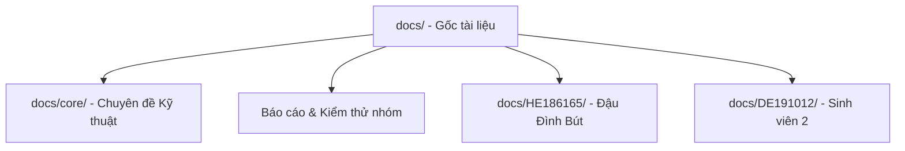

# 🐟 HảiSản.vn — Cổng Thông Tin Tài Liệu Kỹ Thuật & Quản Trị Hệ Thống

> **Chào mừng đến với Cổng thông tin Nhà phát triển (Developer Portal) của dự án HảiSản.vn.**  
> Tài liệu này đóng vai trò là thư mục chỉ mục trung tâm, sắp xếp và phân loại toàn bộ hồ sơ kỹ thuật, báo cáo tiến độ và nhật ký tương tác AI phục vụ công tác bảo vệ đồ án của nhóm.

---

## 🏗️ 1. Sơ đồ Kiến trúc & Phân nhóm Tài liệu

Hệ thống tài liệu được chia thành 3 phân khu chức năng riêng biệt để hội đồng chấm thi và giảng viên dễ dàng tra cứu:

---

## 📘 2. Các chuyên đề kỹ thuật cốt lõi (Core System Documentation)

Toàn bộ tài liệu phân tích kiến trúc hệ thống, mã nguồn chi tiết của phân hệ Backend, Client và luồng dữ liệu thời gian thực được sắp xếp gọn gàng trong thư mục [docs/core/](file:///c:/Users/PC/OneDrive/Desktop/sea_shop/sea_shop/swp391-su26-ai-audit-project-swp391_se20a04_group-06/docs/core/):

| Chuyên đề | Tên tài liệu & Đường dẫn liên kết | Mô tả nội dung kỹ thuật |
|:---:|---|---|
| **01** | [Kiến Trúc & Thiết Kế Hệ Thống](file:///c:/Users/PC/OneDrive/Desktop/sea_shop/sea_shop/swp391-su26-ai-audit-project-swp391_se20a04_group-06/docs/core/01_architecture_and_design.md) | Phân tích luồng Client-Server, cơ chế bảo mật (JWT + Redis Blacklist), thiết kế ERD MongoDB và các chỉ mục định vị không gian GeoJSON `2dsphere`. |
| **02** | [Phân Tích Mã Nguồn Hạ Tầng Backend](file:///c:/Users/PC/OneDrive/Desktop/sea_shop/sea_shop/swp391-su26-ai-audit-project-swp391_se20a04_group-06/docs/core/02_backend_framework_core.md) | Giải thích chi tiết dòng code (Line-by-line) của các tệp bootstrap `app.ts`, cấu hình DB `db.ts`, server thời gian thực `socket.ts`, và các middlewares bảo mật. |
| **03** | [Bản Đồ Nghiệp Vụ & Kiểm Thử Backend](file:///c:/Users/PC/OneDrive/Desktop/sea_shop/sea_shop/swp391-su26-ai-audit-project-swp391_se20a04_group-06/docs/core/03_backend_business_logic.md) | Bản đồ hóa các thư mục logic nghiệp vụ, giải thích cụ thể về cơ chế xóa cascade GDPR, lọc địa lý `$near` GPS, nhận webhook thanh toán Sepay và bộ unit test Jest. |
| **04** | [Phân Tích Mã Nguồn Nền Tảng Client](file:///c:/Users/PC/OneDrive/Desktop/sea_shop/sea_shop/swp391-su26-ai-audit-project-swp391_se20a04_group-06/docs/core/04_client_architecture_and_core.md) | Phân tích cấu trúc React client, các Router Guards bảo mật, cơ chế đồng bộ Access Token và VideoCallProvider (WebRTC state). |
| **05** | [Bản Đồ Trang & Giao Diện React](file:///c:/Users/PC/OneDrive/Desktop/sea_shop/sea_shop/swp391-su26-ai-audit-project-swp391_se20a04_group-06/docs/core/05_client_pages_and_components.md) | Giải thích mã nguồn các thành phần giao diện phức tạp: Khám phá bản đồ Leaflet, hộp chat thời gian thực Socket.IO và giao diện cuộc gọi video WebRTC. |
| **06** | [Vòng Đời Use Case & Kiểm Thử Tự Động](file:///c:/Users/PC/OneDrive/Desktop/sea_shop/sea_shop/swp391-su26-ai-audit-project-swp391_se20a04_group-06/docs/core/06_usecase_lifecycle_and_testing_guide.md) | Mô hình hóa sơ đồ tuần tự (Sequence Diagram) luồng Request-Response của hai use cases điển hình: Google Auth/Mock và Đẩy tin (Bump Cooldown). |
| **07** | [Hướng dẫn Tích hợp Swagger API](file:///c:/Users/PC/OneDrive/Desktop/sea_shop/sea_shop/swp391-su26-ai-audit-project-swp391_se20a04_group-06/docs/core/07_frontend_swagger_integration_guide.md) | Cẩm nang chi tiết dành cho lập trình viên để xây dựng và tra cứu tài liệu API tự động qua Swagger UI. |
| **08** | [Hướng dẫn Tích hợp Real-time Socket.IO](file:///c:/Users/PC/OneDrive/Desktop/sea_shop/sea_shop/swp391-su26-ai-audit-project-swp391_se20a04_group-06/docs/core/08_socket_io_realtime_guide.md) | Tài liệu hướng dẫn bắt tay signaling WebRTC và trao đổi tin nhắn trực tiếp qua giao thức WebSockets. |

---

## 📈 3. Báo cáo tiến độ chung & Kế hoạch kiểm thử nhóm

Kế hoạch phát triển chung của nhóm, lịch sử cập nhật mã nguồn cùng toàn bộ kịch bản kiểm thử phục vụ bài Lab 4 được lưu trữ tại đây:

* **Báo cáo tiến độ chung**:
  * [MIDTERM_PROGRESS_REPORT_PLAN.md](file:///c:/Users/PC/OneDrive/Desktop/sea_shop/sea_shop/swp391-su26-ai-audit-project-swp391_se20a04_group-06/docs/MIDTERM_PROGRESS_REPORT_PLAN.md) — Kế hoạch hành động và báo cáo tiến độ giai đoạn giữa kỳ của nhóm.
  * [CHANGELOG.md](file:///c:/Users/PC/OneDrive/Desktop/sea_shop/sea_shop/swp391-su26-ai-audit-project-swp391_se20a04_group-06/docs/CHANGELOG.md) — Nhật ký ghi nhận các thay đổi, tính năng mới cập nhật qua các phiên bản sprint.
* **Hồ sơ kiểm thử Lab 4 (Chuẩn IEEE 829-2008)**:
  * [Lab4_TestPlan_EN.md](file:///c:/Users/PC/OneDrive/Desktop/sea_shop/sea_shop/swp391-su26-ai-audit-project-swp391_se20a04_group-06/lab4/Lab4_TestPlan_EN.md) — Kế hoạch kiểm thử phiên bản tiếng Anh hoàn chỉnh (16 mục).
  * [Lab4_TestPlan_VI.md](file:///c:/Users/PC/OneDrive/Desktop/sea_shop/sea_shop/swp391-su26-ai-audit-project-swp391_se20a04_group-06/lab4/Lab4_TestPlan_VI.md) — Kế hoạch kiểm thử phiên bản tiếng Việt hoàn chỉnh (16 mục).
  * [Lab4_PartBC_VI.md](file:///c:/Users/PC/OneDrive/Desktop/sea_shop/sea_shop/swp391-su26-ai-audit-project-swp391_se20a04_group-06/lab4/Lab4_PartBC_VI.md) — Phần B (AI Interaction Log) và Phần C (Câu hỏi thảo luận phân tích rủi ro kiểm thử thực tế) viết bằng tiếng Việt.

---

## 👤 4. Nhật ký kiểm toán AI & Đóng góp cá nhân (Student AI Logs)

Để đảm bảo tính minh bạch và cá nhân hóa quá trình học tập có sự hỗ trợ của AI theo yêu cầu của môn học, mỗi thành viên trong nhóm sở hữu một phân vùng nhật ký riêng:

### 4.1 Sinh viên Đậu Đình Bút (HE186165)
Hồ sơ cá nhân về các prompt đã sử dụng, phản biện và bài học kinh nghiệm trong quá trình viết code và thiết lập hệ thống:
* **Thư mục lưu trữ**: [docs/HE186165/](file:///c:/Users/PC/OneDrive/Desktop/sea_shop/sea_shop/swp391-su26-ai-audit-project-swp391_se20a04_group-06/docs/HE186165/)
* **Các tệp độc lập**:
  * [AI_Audit_Log_HE186165.md](file:///c:/Users/PC/OneDrive/Desktop/sea_shop/sea_shop/swp391-su26-ai-audit-project-swp391_se20a04_group-06/docs/HE186165/AI_AUDIT_LOG.md) — Nhật ký chi tiết các lần tương tác AI khi xây dựng database schema, API JWT Auth, và Socket.IO chat.
  * [Prompts_HE186165.md](file:///c:/Users/PC/OneDrive/Desktop/sea_shop/sea_shop/swp391-su26-ai-audit-project-swp391_se20a04_group-06/docs/HE186165/PROMPTS.md) — Bộ sưu tập các mẫu câu lệnh (prompts) chi tiết gửi cho AI.
  * [Reflection_HE186165.md](file:///c:/Users/PC/OneDrive/Desktop/sea_shop/sea_shop/swp391-su26-ai-audit-project-swp391_se20a04_group-06/docs/HE186165/REFLECTION.md) — Bài luận phản ánh kinh nghiệm thực tế, kỹ năng tích lũy và giải pháp vượt qua khó khăn.
* **Bản sao ngoài thư mục docs** (sử dụng đối chiếu nhanh):
  * [AI_AUDIT_LOG_Root.md](file:///c:/Users/PC/OneDrive/Desktop/sea_shop/sea_shop/swp391-su26-ai-audit-project-swp391_se20a04_group-06/docs/AI_AUDIT_LOG.md) | [PROMPTS_Root.md](file:///c:/Users/PC/OneDrive/Desktop/sea_shop/sea_shop/swp391-su26-ai-audit-project-swp391_se20a04_group-06/docs/PROMPTS.md) | [REFLECTION_Root.md](file:///c:/Users/PC/OneDrive/Desktop/sea_shop/sea_shop/swp391-su26-ai-audit-project-swp391_se20a04_group-06/docs/REFLECTION.md)

### 4.2 Sinh viên 2 (DE191012)
Hồ sơ cá nhân về các lần tương tác AI và quá trình đóng góp xây dựng hệ thống:
* **Thư mục lưu trữ**: [docs/DE191012/](file:///c:/Users/PC/OneDrive/Desktop/sea_shop/sea_shop/swp391-su26-ai-audit-project-swp391_se20a04_group-06/docs/DE191012/)
* **Các tệp độc lập**:
  * [AI_Audit_Log_DE191012.md](file:///c:/Users/PC/OneDrive/Desktop/sea_shop/sea_shop/swp391-su26-ai-audit-project-swp391_se20a04_group-06/docs/DE191012/AI_AUDIT_LOG.md) — Nhật ký sử dụng AI cá nhân.
  * [Prompts_DE191012.md](file:///c:/Users/PC/OneDrive/Desktop/sea_shop/sea_shop/swp391-su26-ai-audit-project-swp391_se20a04_group-06/docs/DE191012/PROMPTS.md) — Danh sách prompts mẫu cá nhân.
  * [Reflection_DE191012.md](file:///c:/Users/PC/OneDrive/Desktop/sea_shop/sea_shop/swp391-su26-ai-audit-project-swp391_se20a04_group-06/docs/DE191012/REFLECTION.md) — Bài luận đúc rút kinh nghiệm cá nhân.

---

  Made with ❤️ by the HảiSản.vn Documentation Team · 2026

